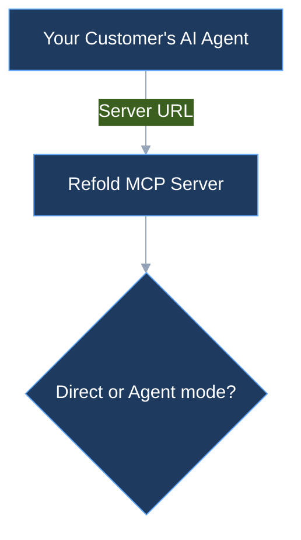

# Component catalog with verbatim examples

Copy-paste-ready patterns drawn from how platform.claude.com uses each Mintlify
component. For the full prop list of any component, see
[mintlify.com/docs/components](https://mintlify.com/docs/components).

## Table of contents
- [Steps](#steps) — procedures
- [Tabs + Steps](#tabs--steps) — multi-language flows
- [CodeGroup](#codegroup) — same code, many languages
- [Code blocks](#code-blocks) — labels and output pairing
- [Cards & CardGroup](#cards--cardgroup) — routing
- [Callouts](#callouts) — Note / Warning / Tip / Info
- [Tables](#tables) — matrices
- [FAQ sections](#faq-sections) — accordions
- [Tooltip](#tooltip) — inline glossary
- [Frame & mermaid](#frame--mermaid) — visuals

---

## Steps

For any procedure a reader follows. Imperative `title`, bold UI literals, code
inside the step.

```mdx
<Steps>
  <Step title="Open workspace settings">
    In the Claude Console, go to **Settings > Workspaces**.
  </Step>
  <Step title="Create a workspace">
    Click **Create workspace**.
  </Step>
  <Step title="Configure the workspace">
    Enter a workspace name and select a color for visual identification.
  </Step>
</Steps>
```

"Best practices" is the same component used for recommendations — each step is a
recommendation with a one-line rationale:

```mdx
<Steps>
  <Step title="Use meaningful names">
    Name workspaces clearly to indicate their purpose (for example,
    "Production - Customer Chatbot").
  </Step>
</Steps>
```

A short inline sub-procedure stays a plain numbered list — don't over-componentize:

```mdx
1. Select the workspace from the list
2. Click the ellipsis menu (**...**) and choose **Edit details**
3. Update the name or color and save your changes
```

---

## Tabs + Steps

Multi-language / multi-client flows: `<Tabs>` outer, a complete `<Steps>` inside
each tab so each path is self-contained.

```mdx
<Tabs>
  <Tab title="cURL">
    <Steps>
      <Step title="Set your API key">
        ```bash
        export REFOLD_API_KEY="your-api-key-here"
        ```
      </Step>
      <Step title="Make your first call">
        ```bash cURL
        curl https://api.refold.ai/v1/… -H "x-api-key: $REFOLD_API_KEY"
        ```
        ```json Output
        { "id": "…", "status": "ok" }
        ```
      </Step>
    </Steps>
  </Tab>
  <Tab title="Node">
    <Steps> … </Steps>
  </Tab>
</Tabs>
```

---

## CodeGroup

When it's the *same* operation shown in several languages with no prose between
them, `<CodeGroup>` renders one block with language switcher tabs. Use this for
SDK reference snippets; use `<Tabs>`+`<Steps>` when each language needs its own
narrated steps.

```mdx
<CodeGroup>
```bash cURL
curl …
```
```python Python
client.messages.create(…)
```
</CodeGroup>
```

---

## Code blocks

- Label every block with language and, when helpful, a role:
  ```` ```bash cURL ````, ```` ```json Output ````, ```` ```python Python ````.
- Pair a request with its response so success is verifiable:

```mdx
```bash cURL
curl --request POST "https://api.anthropic.com/v1/organizations/workspaces" \
  --data '{"name": "Production"}'
```
```

Follow code that summarizes an endpoint with a link to the full reference:
> For complete parameter details and response schemas, see the
> [Workspaces API reference](/…).

---

## Cards & CardGroup

Routing the reader onward. A single `<Card>` for the one best next action; a
`<CardGroup cols={3}>` for a menu.

```mdx
<Card title="Working with the Messages API" icon="messages" href="/docs/…">
  Learn multi-turn conversations, system prompts, and other core patterns.
</Card>

<CardGroup cols={3}>
  <Card title="Intro to Claude" icon="check" href="/docs/en/intro">
    Explore Claude's capabilities and development flow.
  </Card>
  <Card title="Quickstart" icon="lightning" href="/docs/en/get-started">
    Learn how to make your first API call in minutes.
  </Card>
  <Card title="Claude Console" icon="code" href="/">
    Craft and test powerful prompts directly in your browser.
  </Card>
</CardGroup>
```

Each card: a 2–4 word title, an `icon`, an `href`, and a one-line body that says
what the reader gets there.

---

## Callouts

```mdx
<Note>
Only organization admins can create workspaces. Organization users and
developers must be added to workspaces by an admin.
</Note>

<Warning>
Archiving a workspace immediately revokes all API keys in that workspace. This
action cannot be undone.
</Warning>

<Tip>
To switch between workspaces in the Console, use the **Workspaces** selector in
the top-left corner.
</Tip>

<Info>
Claude Mythos Preview is offered separately as a research preview model. Access
is invitation-only and there is no self-serve sign-up.
</Info>
```

A callout can hold a short bulleted list when several related constraints belong
together:

```mdx
<Note>
- You cannot set limits on the Default Workspace
- If not set, workspace limits match the organization's limits
- Organization-wide limits always apply
</Note>
```

---

## Tables

Any two-dimensional relationship. Keep headers short; bold nothing in the body
unless it's a defined term or literal.

```mdx
| Role | Permissions |
|------|-------------|
| Workspace User | Use the Workbench only |
| Workspace Developer | Create and manage API keys, use the API |
| Workspace Admin | Full control over workspace settings and members |
```

For caveats that don't fit a cell, use a footnote below the table with `<sup>`:

```mdx
| Feature | Value<sup>1</sup> |
…
_<sup>1 - See [Pricing](/…) for complete details.</sup>_
```

---

## FAQ sections

Repeated question→answer pairs render as accordions with `<section>`. Phrase each
title as the literal question.

```mdx
## FAQ

<section title="What's the Default Workspace?">

Every organization has a "Default Workspace" that cannot be edited, renamed, or
removed. Usage attributed to it shows a `null` value for `workspace_id`.

</section>

<section title="Are there limits on workspaces?">

Yes, you can have a maximum of 100 workspaces per organization. Archived
workspaces do not count toward this limit.

</section>
```

(Some Mintlify setups use `<AccordionGroup>` / `<Accordion>` instead — match
whatever the surrounding pages in this repo already use.)

---

## Tooltip

Inline glossary without breaking the sentence.

```mdx
**Context window** <Tooltip tooltipContent="~555k words / ~2.5M characters">1M tokens</Tooltip>
```

---

## Frame & mermaid

Screenshots go in a `<Frame>` (gives a caption + border). Architecture and data
flow go in a themed `mermaid` block:

```mdx
<Frame>
  
</Frame>
```

```mdx

```

Copy the `%%{init…}%%` palette from an existing real Refold page so diagrams stay
on-brand instead of using mermaid's default theme.
