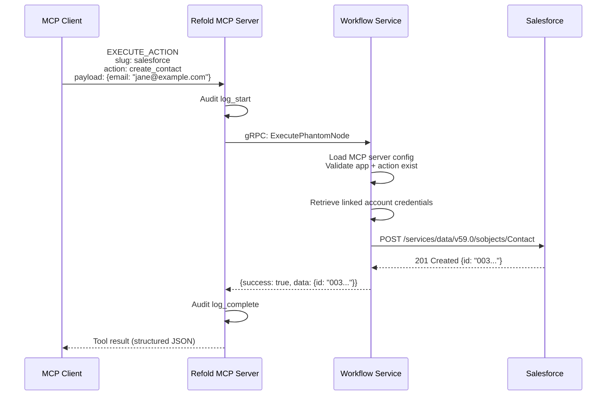

This page describes the internal architecture of the Refold MCP server. It is intended for technical evaluators, integration architects, and developers building against the MCP protocol.

## System overview

```mermaid
flowchart TD
    subgraph Clients["MCP Clients"]
        C1["Claude Desktop"]
        C2["Cursor"]
        C3["Windsurf"]
        C4["Custom Agent"]
    end

    C1 & C2 & C3 & C4 -->|"Streamable HTTP<br/>MCP v2025-11-25"| MCP

    subgraph MCP["Refold MCP Server"]
        direction TB
        AUTH["TokenAuthMiddleware<br/>Validates token → resolves identity"]
        SESSION["LinkedAccountSessionMiddleware<br/>Resolves tools per-request<br/>Intercepts every call for audit"]
        TOOLS["Tool Handlers"]
        AUTH --> SESSION --> TOOLS
    end

    subgraph ToolSet["Available Tools"]
        direction LR
        T1["RESOLVE_ACTIONS"]
        T2["EXECUTE_ACTION"]
        T3["Direct Action Tools"]
        T4["LOAD_SKILL"]
        T5["SEARCH_INTEGRATION_GRAPH"]
    end

    TOOLS --> ToolSet

    subgraph Services["Backend Services"]
        S1[("Auth Service<br/>gRPC")]
        S2[("Workflow Service<br/>gRPC")]
        S3[("MongoDB<br/>Audit Logs")]
    end

    AUTH -.->|"Validate token"| S1
    ToolSet -->|"Execute actions"| S2
    SESSION -.->|"Log every call"| S3

    S2 -->|"API calls with<br/>stored credentials"| APPS

    subgraph APPS["Connected Applications"]
        A1["Salesforce"]
        A2["SAP"]
        A3["Workday"]
        A4["300+ more"]
    end

    style MCP fill:#1a1a2e,stroke:#4a4a8a
    style Services fill:#1a2a1a,stroke:#4a8a4a
    style APPS fill:#2a1a1a,stroke:#8a4a4a
```



## Request lifecycle

Every request follows the same path regardless of mode.

### 1. Token validation

The `TokenAuthMiddleware` extracts the token and server_id from the URL path. It calls auth-service over gRPC to validate the token and resolve the caller's identity.

The result is a `SessionAuth` context:

| Field | Description |
|-------|-------------|
| `org_id` | Organization this linked account belongs to |
| `linked_account_id` | The specific end-user connection |
| `environment` | `test` or `production` |
| `mcp_server_id` | Which MCP server configuration to use |
| `direct_mode` | `true` (default) or `false` (when `?mode=agent`) |
| `expose_skills` | `true` or `false` (when `?expose_skills=true`) |

This context is frozen for the lifetime of the request. It cannot be modified by tool handlers or downstream code.

### 2. Tool resolution

The `LinkedAccountSessionMiddleware` resolves the tool set on every `tools/list` and `tools/call` request. There is no cached tool state on the middleware instance.

**Direct mode** (default):
- Calls workflow-service over gRPC to get the MCP server configuration
- Reads all associated apps, their actions, and their workflows
- Creates one `DirectActionTool` per action/workflow with auto-generated names and fixed schemas
- Adds skill tools if `expose_skills=true`

**Agent mode** (`?mode=agent`):
- Registers `RESOLVE_ACTIONS` and `EXECUTE_ACTION` as the primary tools
- Adds skill tools if `expose_skills=true`
- Does not create per-action tools

### 3. Tool execution

When an agent calls a tool, the middleware:

1. Resolves the authenticated identity from the current request
2. Resolves the full tool set to find the requested tool
3. Logs the invocation start (tool name, input, identity, client metadata)
4. Executes the tool handler
5. Logs the invocation result (output, status, duration)
6. Returns the result to the agent

If the tool is `EXECUTE_ACTION` or a direct-mode tool, execution flows through to workflow-service over gRPC, which makes the actual API call to the third-party application using the linked account's stored credentials.

### 4. Action execution detail



## Service dependencies

| Service | Protocol | Purpose |
|---------|----------|---------|
| **auth-service** | gRPC | Token validation, identity resolution |
| **workflow-service** | gRPC | MCP server config, app/action catalog, action execution |
| **MongoDB** | TCP | Audit log persistence |

The MCP server is stateless. It holds no session state between requests. All identity, configuration, and credential data is resolved per-request from the upstream services.

## Tool registration model

Tools are registered using two patterns:

**Static registration** (`ToolRegistration`): A fixed tool with a name, description, and handler function. Used for tools that don't need per-session customization.

**Factory registration** (`ToolFactory`): An async function that takes `SessionAuth` and returns a `ToolRegistration`. Used when the tool description or behavior depends on the caller's identity. For example, `RESOLVE_ACTIONS` builds its description dynamically based on which apps are configured on the server.

Both patterns produce standard FastMCP `Tool` objects at runtime.

## Direct mode tool naming

In direct mode, tool names are auto-generated from the app slug and action name:

```
{app_slug}_{action_name}_{type}
```

Examples:
- `salesforce_create_contact_action`
- `workday_get_workers_action`
- `hubspot_sync_leads_workflow`

Names are slugified (lowercased, special characters replaced with underscores) and deduplicated with numeric suffixes if needed.

## Protocol details

| Property | Value |
|----------|-------|
| **MCP version** | v2025-11-25 |
| **Transport** | Streamable HTTP (`stateless_http=true`) |
| **Server framework** | FastMCP (Python) mounted as sub-app inside FastAPI |
| **Path pattern** | `/{token}/{server_id}` (mounted under `/mcp/v1/`) |
| **Timeout** | 300 seconds per tool call (configurable per tool) |
