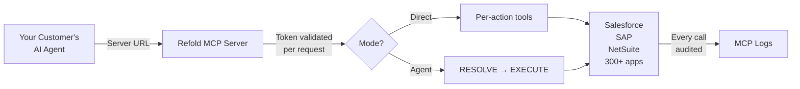

Refold MCP lets ISVs expose their integrations to AI agents over the [Model Context Protocol](https://modelcontextprotocol.io). You configure an MCP server in the Refold dashboard, connect the enterprise apps your customers use, and hand them a URL. Their AI agents connect to that URL and get access to integration actions they can discover and call.

No custom integration code. No agent framework. Refold handles authentication, execution, tenant isolation, and audit logging.

<CardGroup cols={3}>
  <Card title="300+ Connectors" icon="plug">
    Salesforce, SAP, NetSuite, Workday, HubSpot, and [hundreds more](/resources/integration-providers/overview)
  </Card>
  <Card title="Full Audit Trail" icon="clipboard-list">
    Every tool call logged with identity, input, output, and timing
  </Card>
  <Card title="Tenant Isolation" icon="shield">
    Per-request identity resolution. No shared state across sessions.
  </Card>
</CardGroup>

## How it works

<Steps>
  <Step title="Create an MCP server">
    Go to **Embedded Agents > MCP Servers** and create a new server. Give it a name and description that tells the agent what it can do.
  </Step>
  <Step title="Add applications">
    Attach the apps your customers need (Salesforce, SAP, NetSuite, etc.). Select which actions and workflows to expose.
  </Step>
  <Step title="Choose your mode">
    **Direct mode** exposes each action as its own tool. **Agent mode** uses two meta-tools that let the agent resolve intent before executing. See [Tools Reference](/mcp/tools-reference) for details.
  </Step>
  <Step title="Connect">
    Copy the Server URL and register it in any MCP client. The agent authenticates via the token in the URL and starts calling tools.
  </Step>
</Steps>

## What the agent can do

Once connected, an agent can:

- **Call integration actions** directly: create records, query data, update fields across connected apps
- **Run workflows** as single tool calls with built-in error handling and retry logic
- **Discover skills** to find pre-built procedures for complex multi-step operations
- **Work across multiple apps** in a single session (e.g., read from Salesforce, write to SAP)

Every tool call is authenticated and logged in [MCP Logs](/mcp/logs).

## Two operating modes

| Mode | How it works | Best for |
|------|-------------|----------|
| **Direct** (default) | Each app action becomes its own tool | Simple setups with a small number of actions |
| **Agent** | Two meta-tools (`RESOLVE_ACTIONS` + `EXECUTE_ACTION`) let the agent resolve what to call first, then execute | Servers with many actions across multiple apps |

## Choosing your pattern

Refold MCP gives you three levels of agent guidance. Pick based on how much control you want over the agent's behavior.

```mermaid
flowchart TD
    Q["How complex is the operation?"] --> S1
    Q --> S2
    Q --> S3

    S1["Single API call<br/>(create contact, get invoice)"]
    S2["Multi-step, but agent<br/>can figure out the order"]
    S3["Multi-step with strict<br/>sequencing and error handling"]

    S1 --> P1["<b>Direct Mode</b><br/>One tool per action<br/>Agent calls it directly"]
    S2 --> P2["<b>Agent Mode + Skills</b><br/>Agent discovers the right skill,<br/>follows its steps, resolves and executes"]
    S3 --> P3["<b>Workflows as MCP Tools</b><br/>Entire process runs as one tool call<br/>with built-in retries and validation"]

    P1 -.- L1["Least complex<br/>Most constrained"]
    P3 -.- L3["Most complex<br/>Most reliable"]

    style P1 fill:#1a3a2a,stroke:#4ade80
    style P2 fill:#1a2a3a,stroke:#60a5fa
    style P3 fill:#2a1a3a,stroke:#a78bfa
```

| Pattern | Agent decides | You define | Best for |
|---------|--------------|-----------|----------|
| **Direct mode** | Which tool to call and with what input | The exact set of available actions | Simple CRUD. Under 20 actions. |
| **Agent mode + Skills** | How to decompose the task, which skills to load | The procedures (skills) the agent can follow | Complex tasks where you want guidance but flexibility |
| **Workflows as MCP tools** | When to trigger the workflow | The full process: steps, error handling, retries, rollback | Business-critical processes where consistency matters more than flexibility |

These patterns are not mutually exclusive. A single server can expose direct actions for simple lookups, skills for multi-step procedures, and workflows for mission-critical processes.

## Built for production

Refold MCP is not a demo wrapper around APIs. It runs in production across enterprise deployments.

| Concern | How it's handled |
|---------|-----------------|
| **Authentication** | Token validated on every request. Fails closed. |
| **Tenant isolation** | Identity resolved per-request. No shared mutable state. |
| **Audit** | Every tool call logged with full input/output, client metadata, and timing. |
| **Credential security** | Third-party OAuth tokens and API keys are never exposed to agents. |
| **Error handling** | Structured error statuses. Audit logs capture failures with diagnostics. |
| **Transport** | MCP v2025-11-25 over Streamable HTTP with TLS. |

For details, see [Security & Governance](/mcp/security-governance) and [Architecture](/mcp/architecture).

## Next steps

<CardGroup cols={3}>
  <Card title="Getting Started" icon="play" href="/mcp/getting-started">
    Set up your first MCP server and connect from Claude or Cursor
  </Card>
  <Card title="Tools Reference" icon="wrench" href="/mcp/tools-reference">
    All MCP tools, parameters, and execution patterns
  </Card>
  <Card title="Security & Governance" icon="shield-halved" href="/mcp/security-governance">
    Auth model, isolation, audit logging, and data handling
  </Card>
  <Card title="Architecture" icon="sitemap" href="/mcp/architecture">
    How the server processes requests and executes actions
  </Card>
  <Card title="FAQ" icon="circle-question" href="/mcp/faq">
    Common questions about security, access control, and operations
  </Card>
  <Card title="Integration Catalog" icon="grid-2" href="/resources/integration-providers/overview">
    Browse 300+ supported applications
  </Card>
</CardGroup>
