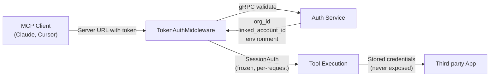

This page documents how Refold MCP handles authentication, authorization, tenant isolation, and data governance. It is intended for security reviews, compliance evaluations, and architecture assessments.

## Authentication

Every MCP server connection is authenticated via a token embedded in the Server URL. The token is validated on every request against Refold's auth service over gRPC.

**Auth flow:**



| Property | Detail |
|----------|--------|
| **Token type** | Linked account token (opaque, server-generated) |
| **Validation** | Every HTTP request validated via gRPC to auth-service |
| **Identity resolution** | Token resolves to org_id + linked_account_id + environment |
| **Token scope** | One token per linked account per MCP server |
| **Invalid token** | Returns HTTP 403 immediately. No tool listing, no partial access. |
| **Auth service unavailable** | Returns HTTP 503. Fails closed, never falls back to unauthenticated access. |

### Linked account isolation

Each token is scoped to a single linked account. When an agent connects:

- It can only access apps and actions configured on that specific MCP server
- All downstream API calls use the credentials of that linked account
- No cross-account data access is possible within a single session

Two users connecting to the same MCP server with different tokens see the same tool set but operate on different credentials and data.

### Credential handling

Refold manages OAuth tokens and API keys for connected applications on behalf of linked accounts. MCP tool handlers never receive raw third-party credentials. The execution path is:

```
Agent calls EXECUTE_ACTION
    → Refold resolves linked account credentials internally
    → Refold makes the API call to the third-party app
    → Result returned to agent
```

Third-party credentials are stored encrypted at rest and are never exposed in MCP tool inputs, outputs, or audit logs.

## Tenant isolation

MCP servers are multi-tenant by design. Isolation is enforced at multiple layers:

| Layer | Mechanism |
|-------|-----------|
| **Request identity** | SessionAuth resolved per-request from the validated token. No shared mutable state across sessions. |
| **Tool resolution** | Tools are resolved per-request based on the authenticated identity. Two concurrent sessions never share tool objects. |
| **Execution context** | Each tool call reads org_id, linked_account_id, and environment from the per-request auth context. These fields are immutable for the duration of the request. |
| **Data** | Audit records, tool outputs, and execution metadata are partitioned by org_id. Queries are always scoped. |

<Info>
Session isolation was hardened in the v3 architecture. Tools are resolved on every request via the `on_list_tools` and `on_call_tool` middleware hooks, not cached on the middleware instance.
</Info>

## Audit logging

Every MCP tool call is logged automatically. Audit logging cannot be disabled and does not require configuration.

### What's captured

| Field | Description |
|-------|-------------|
| **Identity** | org_id, linked_account_id, mcp_server_id, environment |
| **Tool** | Tool name (e.g., `EXECUTE_ACTION`, `RESOLVE_ACTIONS`, or direct-mode tool name) |
| **Execution target** | Application slug, action/workflow ID, target type |
| **Input** | Full JSON arguments sent by the agent (capped at 32KB) |
| **Output** | Full JSON result returned to the agent (capped at 64KB, truncation flagged) |
| **Status** | `SUCCESS`, `PENDING`, `VALIDATION_ERROR`, or `EXECUTION_ERROR` |
| **Timing** | Start time, completion time, duration in milliseconds |
| **Client metadata** | MCP client name/version, protocol version, transport type, session ID, trace ID |

### What's NOT captured

- Third-party app credentials (never logged)
- Raw HTTP requests to downstream APIs (only the MCP-layer input/output)

### Audit guarantees

- **Best-effort writes**: Audit failure never blocks tool execution. If the audit write fails, the tool call still completes and returns results to the agent.
- **Immutable records**: Audit entries are append-only. Completed records are not modified after write.
- **Scoped queries**: All audit queries are filtered by org_id. No org can access another org's audit records.
- **Correlation**: Session ID and Trace ID (X-Request-Id) allow grouping all tool calls from a single agent conversation.

Audit records are stored in Refold's database, partitioned by org. See [MCP Logs](/mcp/logs) for how to view and filter audit records in the dashboard.

## Transport security

| Property | Detail |
|----------|--------|
| **Protocol** | MCP v2025-11-25 over Streamable HTTP |
| **Encryption** | TLS 1.2+ for all connections |
| **Transport mode** | Stateless HTTP (no persistent WebSocket connections) |
| **CORS** | Configurable per deployment |

## Access control

### What you can control today

| Control | How |
|---------|-----|
| **Which apps an agent can access** | Add/remove apps on the MCP server's Applications tab |
| **Which actions are available** | Select specific actions per app when adding to the server |
| **Direct vs agent mode** | Toggle Agent Mode to control whether agents see raw tools or resolve/execute |
| **Skill access** | Toggle Retrieve Skill to control whether agents can discover and load skills |
| **Per-user scoping** | Each linked account gets a unique token. Different users get different URLs. |

### Roadmap

Per-user token management (multiple users sharing a linked account with distinct credentials) and tool-level RBAC are scoped for upcoming releases.

## Deployment

Refold MCP servers run on Refold's managed infrastructure. For deployment options including dedicated and self-hosted environments, see [Deployment](/deployment/overview).
