The tools an agent sees depend on your server's toggle configuration.

## Tool availability

| Tool | Available when | Purpose |
|------|---------------|---------|
| Per-action tools | Agent Mode **OFF** (default) | One tool per app action/workflow |
| `RESOLVE_ACTIONS` | Agent Mode **ON** | Resolves user intent to a list of specific actions |
| `EXECUTE_ACTION` | Agent Mode **ON** | Executes one action or workflow from the resolved plan |
| `SEARCH_INTEGRATION_GRAPH` | Retrieve Skill **ON** | Discovers entities, actions, and skills in the knowledge graph |
| `LOAD_SKILL` | Retrieve Skill **ON** | Loads the full content of a specific skill |
| `AUTH` | Auth Tool **ON** | Returns a re-auth link when a connected app's credentials are missing or expired |

---

## Direct mode (default)

When Agent Mode is off, each action and workflow on the server becomes its own tool. Names are auto-generated from the app slug and action name.

**Example tool names:**
```
salesforce_create_contact_action
salesforce_list_deals_action
sap_get_purchase_order_action
hubspot_sync_leads_workflow
```

Each tool has a fixed schema. The `application_slug`, `action_id`, and `type` fields are pre-bound by Refold so the agent cannot change them. The only thing the agent fills in is the `input_payload`.

**When to use direct mode:** Your server has a small number of actions (under ~20) and you want the agent to see exactly what's available without an extra resolution step.

---

## Agent mode

When Agent Mode is on, per-action tools are replaced with two meta-tools.

### RESOLVE_ACTIONS

Takes the user's request and figures out which actions need to run.

| Parameter | Type | Required | Description |
|-----------|------|----------|-------------|
| `integration_query` | `list[string]` | Yes | Action descriptions extracted from the user's request. Each entry describes one action. |

**How to build `integration_query`:**
- Break the user's request into individual actions
- Each entry should be a short description including the action and the target app

**Example:**
```
User: "Get all my Salesforce contacts and create a note in HubSpot"

integration_query: [
  "List Contacts Salesforce",
  "Create Note HubSpot"
]
```

**Returns:** A list of resolved entities, each with:
- `slug` (app identifier)
- `type` (`action` or `workflow`)
- `identifier` (action or workflow ID)
- `json_schema` (input schema for the action)

### EXECUTE_ACTION

Runs a single action or workflow. Call this once per resolved action from the RESOLVE_ACTIONS output.

| Parameter | Type | Required | Description |
|-----------|------|----------|-------------|
| `application_slug` | `string` | Yes | The app to run against (e.g., `"salesforce"`) |
| `action_id` | `string` | Yes | The action or workflow ID from the resolved plan |
| `input_payload` | `object` | Yes | Input fields for the action (e.g., `{"email": "user@example.com"}`) |
| `type` | `"action"` or `"workflow"` | Yes | Whether this is an action or a workflow |

**Example:**
```json
{
  "application_slug": "hubspot",
  "action_id": "create_contact",
  "input_payload": {
    "email": "jane@example.com",
    "firstname": "Jane",
    "lastname": "Doe"
  },
  "type": "action"
}
```

**When to use agent mode:** Your server has many actions across multiple apps. The resolve/execute pattern keeps the tool list short and lets the agent figure out the right action from natural language.

---

## Skill tools

Available when Retrieve Skill is enabled. These can be combined with either direct or agent mode.

### SEARCH_INTEGRATION_GRAPH

Queries the integration knowledge graph for entities, actions, and skills.

| Parameter | Type | Default | Description |
|-----------|------|---------|-------------|
| `entity_name` | `string` | required | What to search for (e.g., `"Contacts"`, `"Purchase Orders"`) |
| `related_entity_name` | `string` | `null` | Optional second entity. When provided, the search returns how the two entities relate across connected apps. |
| `apps` | `list[string]` | `null` | Restrict the search to specific app slugs |
| `limit` | `int` | `25` | Maximum number of results to return |
| `min_confidence` | `float` | `0.5` | Drop results below this match score (0.0 – 1.0) |
| `depth` | `int` | `1` | How far to traverse from the starting entity. Higher values surface more distant relationships at the cost of relevance. |
| `max_response_chars` | `int` | `12000` | Cap on response size in characters |

Defaults are tuned for typical use. Most agents will only need `entity_name` and optionally `apps`.

### LOAD_SKILL

Loads the full content of a skill by ID or name. At least one parameter must be provided.

| Parameter | Type | Description |
|-----------|------|-------------|
| `skill_id` | `string` | The skill's ID (from SEARCH_INTEGRATION_GRAPH results or the Skills tab) |
| `skill_name` | `string` | Look up a skill by name instead of ID |

For how skills are surfaced to the agent at session start and the typical discovery flow, see [Skills](/mcp/skills).

---

## AUTH

Available when the **Auth Tool** toggle is on. The agent calls `AUTH` when a downstream action fails because the linked account's credentials for that app are missing or expired. The tool returns an authentication URL the end user can complete to reconnect the app, after which the agent can retry the original action.

| Parameter | Type | Required | Description |
|-----------|------|----------|-------------|
| `application_slug` | `string` | Yes | The app the user needs to authenticate (e.g., `"salesforce"`) |

**Returns:** an object with the auth URL and a short message the agent can relay to the user.

---

## Execution sequence

When both Agent Mode and Retrieve Skill are enabled, the recommended tool call order is:

```mermaid
flowchart LR
    A["SEARCH_INTEGRATION_GRAPH<br/>Find entities and skills"] --> B["LOAD_SKILL<br/>(if relevant)<br/>Load procedure"]
    B --> C["RESOLVE_ACTIONS<br/>Resolve intent<br/>to specific actions"]
    C --> D["EXECUTE_ACTION<br/>Run each action<br/>from the plan"]

    style A fill:#1a2a3a,stroke:#60a5fa
    style B fill:#1a2a3a,stroke:#60a5fa
    style C fill:#1a3a2a,stroke:#4ade80
    style D fill:#2a1a1a,stroke:#f87171
```



<Warning>
The tool descriptions enforce this ordering. EXECUTE_ACTION should only be called after RESOLVE_ACTIONS returns a plan. Agents that skip RESOLVE_ACTIONS will get an error-guidance response from the tool description.
</Warning>
