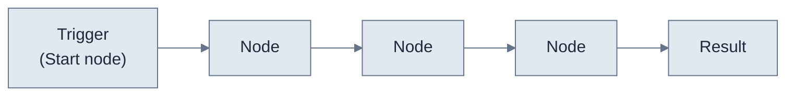

A **workflow** is an automation that moves and transforms data between your application and your users' [linked accounts](/v3/concepts/linked-account). You build it on a visual canvas from a [trigger](/v3/concepts/workflows/triggers/overview) and a sequence of [nodes](/v3/concepts/workflows/nodes/http). Use workflows to sync records, react to events in real time, and let non-technical teams configure integrations without writing code.

## How workflows work

Every workflow is a **trigger** followed by a sequence of **nodes**. The trigger decides when the workflow runs and what data enters it; each node is one step that reads, transforms, or writes that data as it flows to the end.

Key characteristics:

- **Every workflow starts with a trigger**, configured in the **Start node**.
- **Nodes run in order**, each passing its output to the next through [data variables](/v3/concepts/data-variables).
- **Workflows run per linked account**, scoped to that customer's credentials and data.
- **A workflow is built once and reused** across every customer who enables it.

<Note>A workflow has exactly one trigger. To start the same logic in more than one way, build a workflow per trigger or call a shared workflow with the [Sub Flows node](/v3/concepts/workflows/nodes/sub-flows).</Note>

## Triggers

A trigger determines when a workflow runs and how data is passed into it. You set it in the workflow's **Start node**. Refold supports six trigger types.

| Trigger | Starts the workflow when… |
|---------|---------------------------|
| **Schedule** | A set time or recurring interval is reached |
| **Polling** | Records change in a connected app that has no webhooks |
| **Webhook** | An external system sends an HTTP request to a unique URL |
| **Events** | Your application sends a custom event through the Refold SDK or API |
| **App events** | A built-in event fires in your users' connected app |
| **API trigger** | You invoke the workflow directly with an API call |

See [Triggers](/v3/concepts/workflows/triggers/overview) for how to choose and configure each one.

## Nodes

A node is a single step in a workflow. You drag nodes onto the canvas, connect them, and configure each one. Nodes fall into three groups:

- **Utility nodes** — Refold's built-in steps for control flow and data handling, such as [Rule](/v3/concepts/workflows/nodes/rule), [Loop](/v3/concepts/workflows/nodes/loop), [Transform](/v3/concepts/workflows/nodes/transform), [Custom Code](/v3/concepts/workflows/nodes/custom-code), and [HTTP](/v3/concepts/workflows/nodes/http). They don't call a third-party API themselves.
- **App actions** — prebuilt actions for a connected app, like creating a Salesforce contact or fetching a NetSuite invoice. The available actions come from the app's [connector](/v3/platform/concepts/connector/supported-apps-actions).
- **HTTP request** — call any endpoint of a connected app that isn't available as a prebuilt action, using the app's authentication.

{/* MEDIA-TODO: Screenshot of the workflow canvas showing the Start node, a few connected nodes, and the right-hand node panel. */}

## Common use cases

| Use case | What the workflow does |
|----------|------------------------|
| **Sync on event** | Your app sends a `contact.created` event; the workflow creates the matching record in the user's CRM |
| **Real-time inbound sync** | An app event fires when a record changes in the user's app; the workflow updates your application |
| **Scheduled sync** | A schedule trigger runs every few hours to pull records changed since the last run |
| **Notifications** | The workflow posts to Slack or sends an email when something happens in your app |

## Build a workflow

<Steps>
  <Step title="Set the trigger">
    Open the **Start node** and choose how the workflow starts. See [Triggers](/v3/concepts/workflows/triggers/overview).
  </Step>
  <Step title="Add nodes">
    Drag utility nodes and app actions onto the canvas, then connect them in the order the data should flow.
  </Step>
  <Step title="Configure each node">
    Set each node's fields, referencing data from earlier nodes with [data variables](/v3/concepts/data-variables) and [templating](/v3/concepts/workflows/templating).
  </Step>
  <Step title="Test the workflow">
    Use the **Run** tab to execute with sample data and verify the output before shipping. See [Testing](/v3/concepts/workflows/testing).
  </Step>
  <Step title="Deploy">
    Publish the workflow so it runs for every linked account that enables it.
  </Step>
</Steps>

## Next steps

<CardGroup cols={2}>
  <Card title="Triggers" icon="bolt" href="/v3/concepts/workflows/triggers/overview">
    Choose how your workflow starts.
  </Card>
  <Card title="Nodes" icon="diagram-project" href="/v3/concepts/workflows/nodes/http">
    Reference for every node you can add to a workflow.
  </Card>
  <Card title="Data variables & templating" icon="brackets-curly" href="/v3/concepts/data-variables">
    Pass data between nodes and reference it in fields.
  </Card>
  <Card title="Quickstart" icon="play" href="/v3/get-started/quickstart">
    Run your first workflow end to end.
  </Card>
</CardGroup>
