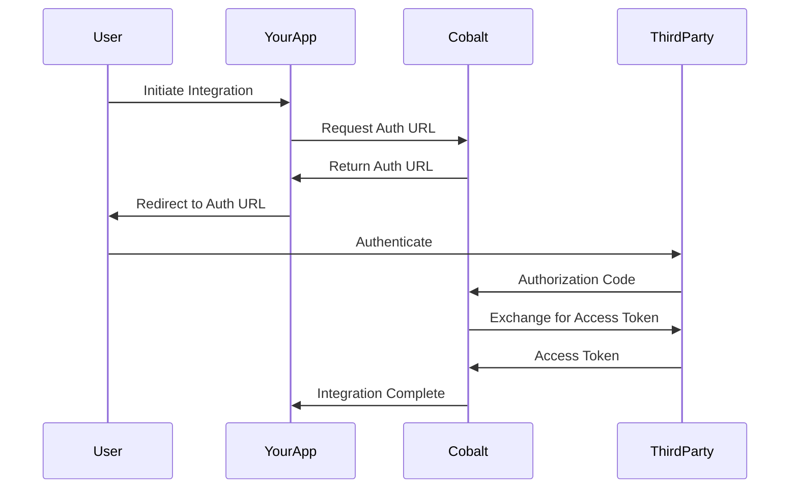

# Authentication

Configure secure authentication methods for your Cobalt integration platform and end users.

## Overview

Cobalt provides multiple authentication methods to ensure secure access to your integration platform while maintaining a seamless user experience. This includes API authentication, OAuth flows, and end-user authentication options.

## API Authentication

### API Keys

API keys are the primary method for authenticating server-to-server requests to the Cobalt API.

<Steps>
  <Step title="Generate API Key">
    Navigate to **Settings** → **API Keys** in your Cobalt dashboard and click **Generate New Key**
  </Step>
  
  <Step title="Configure Permissions">
    Select the appropriate scopes and permissions for your API key based on your use case
  </Step>
  
  <Step title="Store Securely">
    Store your API key securely in environment variables or a secrets management system
  </Step>
  
  <Step title="Use in Requests">
    Include the API key in the `x-api-key` header for all API requests
  </Step>
</Steps>

<CodeGroup>
```javascript Node.js
// Initialize Cobalt SDK with API key
const { CobaltSDK } = require('@cobalt-io/sdk');

const cobalt = new CobaltSDK({
  apiKey: process.env.COBALT_API_KEY,
  environment: 'production'
});
```

```python Python
import os
from cobalt_sdk import CobaltSDK

# Initialize with API key from environment
cobalt = CobaltSDK(
    api_key=os.getenv('COBALT_API_KEY'),
    environment='production'
)
```

```curl cURL
curl -X GET 'https://api.gocobalt.io/api/v1/linked-accounts' \
  -H 'x-api-key: YOUR_API_KEY' \
  -H 'Content-Type: application/json'
```
</CodeGroup>

### API Key Management

<Tabs>
  <Tab title="Key Generation">
    - **Multiple Keys**: Generate separate keys for different environments (dev, staging, production)
    - **Scoped Permissions**: Limit key permissions to specific resources and actions
    - **Naming Convention**: Use descriptive names to identify key purposes
    - **Expiration**: Set expiration dates for enhanced security
  </Tab>
  
  <Tab title="Key Rotation">
    - **Regular Rotation**: Rotate keys every 90 days for security
    - **Gradual Migration**: Use overlapping keys during rotation to avoid downtime
    - **Audit Trail**: Monitor key usage before deactivating old keys
    - **Emergency Rotation**: Immediately rotate keys if compromise is suspected
  </Tab>
  
  <Tab title="Monitoring">
    - **Usage Tracking**: Monitor API key usage patterns and frequency
    - **Rate Limiting**: Track requests against rate limits
    - **Failed Attempts**: Monitor failed authentication attempts
    - **Anomaly Detection**: Alert on unusual usage patterns
  </Tab>
</Tabs>

## OAuth Configuration

### OAuth 2.0 Flow

Cobalt supports OAuth 2.0 for secure authorization with third-party applications.



### OAuth Configuration Steps

<Steps>
  <Step title="Application Registration">
    Register your application with each third-party service you want to integrate
  </Step>
  
  <Step title="Configure Redirect URLs">
    Set up redirect URLs in your OAuth applications:
    ```
    https://api.gocobalt.io/api/v1/oauth/callback
    ```
  </Step>
  
  <Step title="Store Credentials">
    Securely store your OAuth client ID and secret for each integration
  </Step>
  
  <Step title="Configure in Cobalt">
    Add OAuth credentials to your Cobalt application settings
  </Step>
</Steps>

### OAuth Scopes

Configure appropriate OAuth scopes for each integration:

<CodeGroup>
```json Salesforce
{
  "scopes": [
    "api",
    "refresh_token",
    "offline_access",
    "id",
    "profile",
    "email"
  ]
}
```

```json HubSpot
{
  "scopes": [
    "contacts",
    "content",
    "reports",
    "social",
    "automation",
    "timeline",
    "files"
  ]
}
```

```json Google
{
  "scopes": [
    "https://www.googleapis.com/auth/userinfo.email",
    "https://www.googleapis.com/auth/userinfo.profile",
    "https://www.googleapis.com/auth/drive.readonly"
  ]
}
```
</CodeGroup>

## End-User Authentication

### Session Tokens

Session tokens provide secure, temporary access for end users in embedded flows.

<CodeGroup>
```javascript Generate Session Token
// Generate session token for linked account
const sessionToken = await cobalt.sessionTokens.create({
  linked_account_id: 'user_123',
  expires_in: 3600 // 1 hour
});

console.log('Session token:', sessionToken.token);
```

```python Generate Session Token
# Generate session token for linked account
session_token = cobalt.session_tokens.create(
    linked_account_id='user_123',
    expires_in=3600  # 1 hour
)

print(f'Session token: {session_token.token}')
```
</CodeGroup>

### Embedded Authentication

Use session tokens in embedded integration flows:

<CodeGroup>
```javascript React Component
import { CobaltConnect } from '@cobalt-io/react';

function IntegrationFlow({ sessionToken }) {
  return (
    <CobaltConnect
      sessionToken={sessionToken}
      onSuccess={(integration) => {
        console.log('Integration connected:', integration);
      }}
      onError={(error) => {
        console.error('Integration failed:', error);
      }}
    />
  );
}
```

```html HTML/JavaScript
<script src="https://js.gocobalt.io/cobalt-connect.js"></script>

<div id="cobalt-connect"></div>

<script>
  CobaltConnect.init({
    element: '#cobalt-connect',
    sessionToken: 'your_session_token',
    onSuccess: function(integration) {
      console.log('Integration connected:', integration);
    },
    onError: function(error) {
      console.error('Integration failed:', error);
    }
  });
</script>
```
</CodeGroup>

## Security Best Practices

### API Key Security

<Warning>
Never expose API keys in client-side code or public repositories. Always use environment variables or secure secret management.
</Warning>

```javascript
// ✅ Good - Server-side with environment variable
const apiKey = process.env.COBALT_API_KEY;

// ❌ Bad - Client-side or hardcoded
const apiKey = 'pk_live_abc123...'; // Never do this!
```

### OAuth Security

<Tip>
Always validate OAuth state parameters and use PKCE (Proof Key for Code Exchange) when available for enhanced security.
</Tip>

- **State Parameter**: Use random state values to prevent CSRF attacks
- **PKCE**: Implement PKCE for public clients and mobile applications
- **Redirect URI Validation**: Strictly validate redirect URIs
- **Token Storage**: Store tokens securely and never expose them in URLs

### Session Token Security

- **Short Expiration**: Keep session tokens short-lived (1-24 hours)
- **Secure Transmission**: Always use HTTPS for token transmission
- **Single Use**: Consider implementing single-use tokens for sensitive operations
- **IP Validation**: Optionally validate IP addresses for additional security

## Multi-Factor Authentication (MFA)

<Callout type="info">
MFA is available for Enterprise customers and adds an extra layer of security to user accounts.
</Callout>

### Supported MFA Methods

- **TOTP (Time-based One-Time Password)**: Google Authenticator, Authy, etc.
- **SMS**: Text message verification codes
- **Email**: Email-based verification codes
- **Hardware Tokens**: FIDO2/WebAuthn compatible devices

### MFA Configuration

<Steps>
  <Step title="Enable MFA">
    Navigate to **Settings** → **Security** and enable MFA for your organization
  </Step>
  
  <Step title="Configure Methods">
    Select which MFA methods are available to your users
  </Step>
  
  <Step title="Enrollment Policy">
    Set whether MFA is required or optional for different user roles
  </Step>
  
  <Step title="Backup Codes">
    Configure backup code generation for account recovery
  </Step>
</Steps>

## Token Management

### Access Token Lifecycle

<Tabs>
  <Tab title="Token Generation">
    ```javascript
    // Generate access token for integration
    const accessToken = await cobalt.tokens.create({
      linked_account_id: 'user_123',
      application: 'salesforce',
      scopes: ['api', 'refresh_token']
    });
    ```
  </Tab>
  
  <Tab title="Token Refresh">
    ```javascript
    // Refresh expired access token
    const refreshedToken = await cobalt.tokens.refresh({
      linked_account_id: 'user_123',
      application: 'salesforce',
      refresh_token: 'existing_refresh_token'
    });
    ```
  </Tab>
  
  <Tab title="Token Revocation">
    ```javascript
    // Revoke access token
    await cobalt.tokens.revoke({
      linked_account_id: 'user_123',
      application: 'salesforce',
      token: 'access_token_to_revoke'
    });
    ```
  </Tab>
</Tabs>

### Token Storage

<Warning>
Store tokens securely and never log them in plain text. Use encryption for token storage and implement proper access controls.
</Warning>

```javascript
// Example: Secure token storage
const encryptedToken = await encrypt(accessToken, encryptionKey);
await database.storeToken(userId, integrationId, encryptedToken);

// Example: Secure token retrieval
const encryptedToken = await database.getToken(userId, integrationId);
const decryptedToken = await decrypt(encryptedToken, encryptionKey);
```

## Compliance and Auditing

### Audit Logging

All authentication events are logged for security and compliance purposes:

```json
{
  "timestamp": "2024-01-15T10:30:00Z",
  "event_type": "authentication.success",
  "user_id": "user_123",
  "method": "api_key",
  "ip_address": "192.168.1.100",
  "user_agent": "CobaltSDK/1.0.0",
  "resource": "linked_accounts.list"
}
```

### Compliance Standards

Cobalt authentication meets various compliance requirements:

- **SOC 2 Type II**: Security controls and monitoring
- **GDPR**: Data protection and privacy controls
- **HIPAA**: Healthcare data protection (Enterprise)
- **PCI DSS**: Payment card industry standards

## Troubleshooting

### Common Authentication Issues

<Accordion title="Invalid API Key">
**Symptoms**: 401 Unauthorized responses

**Solutions**:
- Verify API key is correct and not expired
- Check API key permissions and scopes
- Ensure proper header format: `x-api-key: YOUR_KEY`
- Regenerate API key if necessary
</Accordion>

<Accordion title="OAuth Flow Failures">
**Symptoms**: Authorization errors, callback failures

**Solutions**:
- Verify OAuth application configuration
- Check redirect URI matches exactly
- Ensure proper scopes are requested
- Validate state parameters
</Accordion>

<Accordion title="Session Token Issues">
**Symptoms**: Embedded flows not working, token expired errors

**Solutions**:
- Check token expiration time
- Verify linked account ID is correct
- Ensure token is passed correctly to frontend
- Regenerate session token if needed
</Accordion>

### Debug Mode

Enable debug logging for authentication troubleshooting:

```javascript
const cobalt = new CobaltSDK({
  apiKey: process.env.COBALT_API_KEY,
  debug: true, // Enable debug logging
  environment: 'production'
});
```

## Next Steps

<CardGroup cols={2}>
  <Card title="Events Configuration" icon="bell" href="/v3/developer-guide/platform/events">
    Set up event handling and notifications
  </Card>
  <Card title="API Proxies" icon="network-wired" href="/v3/developer-guide/platform/api-proxies">
    Configure API proxy settings
  </Card>
</CardGroup> 