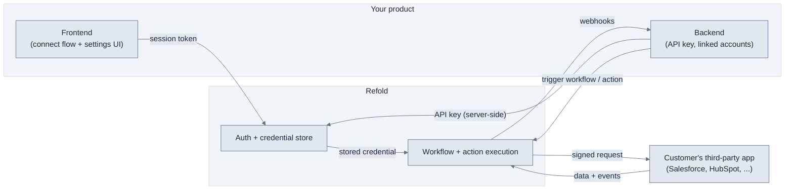

Embedded Marketplace is Refold's product for embedding third-party integrations inside your own SaaS product. Use it to let your customers connect the apps they already use (Salesforce, HubSpot, NetSuite, and [300+ more connectors](/v3/connectors/supported-apps-actions)) and to read, write, and sync their data from your features — without building or maintaining a separate integration for each app.

You ship the connect experience and the in-product settings. Refold handles authentication, token refresh, execution, and tenant isolation. No per-app OAuth code, no credential storage, no integration backend to operate.

## Who it's for

Embedded Marketplace is for product and engineering teams who want integrations to be a feature customers turn on themselves, not a service you deliver one customer at a time.

- **Your customers** connect their own third-party accounts from inside your product and choose what each integration does for them.
- **Your engineers** embed a connect flow, collect per-customer settings, and call Refold to move data, using the [SDKs](/v3/api-reference/javascript-sdk) and [API](/v3/api-reference/overview).

## The three systems

An Embedded Marketplace integration connects three systems, each owning a clear slice of the work. Understanding which system does what is the fastest way to design an integration that is secure and easy to operate.

| System | Owns | Responsibility |
| --- | --- | --- |
| **Your product** | Your customers, your UI, your data | Embeds the connect flow, creates linked accounts, triggers data operations |
| **Refold** | Auth, credentials, execution | Runs the connection flow, stores and refreshes tokens, signs and executes every request, isolates tenants |
| **Third-party app** | The customer's account and data | Authorizes access and serves the read and write requests Refold makes on the customer's behalf |

The key consequence: your product never handles a customer's third-party credentials. The customer authorizes the app, Refold stores the credential against that customer's [linked account](/v3/concepts/linked-account), and from then on your product references the linked account instead of any token.

## Architecture at a glance

## What runs where

Splitting the work across the three systems keeps your API key server-side and your customers' credentials with Refold.

- **Your backend** holds your API key, creates one [linked account](/v3/concepts/linked-account) per customer, mints short-lived [session tokens](/v3/embedded/connect-flow#before-you-start) for the frontend, triggers workflows and actions, and receives [webhooks](/v3/connectors/my-app/webhooks).
- **Your frontend** runs the [connect flow](/v3/embedded/connect-flow) and renders [config fields](/v3/embedded/config-fields/overview), authenticated by a session token, not your API key.
- **Refold** runs the connection and [auth flows](/v3/authentication/overview), stores and refreshes credentials, and executes every [workflow](/v3/workflows/overview) and action using the stored credential for the right linked account.
- **The third-party app** authorizes the connection and serves the requests Refold makes on the customer's behalf.

<Warning>
Your API key carries full account access, so it stays on your backend. The frontend authenticates with a session token instead. Never expose your API key in the browser.
</Warning>

## The building blocks

Four objects combine to turn one connector into a working, per-customer integration. Each is defined once on the platform; this is how they relate in an Embedded Marketplace build.

- **[Linked account](/v3/concepts/linked-account)** is the unit of tenancy. Every connection, credential, config value, and data call is scoped to a linked account, which keeps one customer's data isolated from another's.
- **[Connector](/v3/connectors/supported-apps-actions)** is the third-party app and the set of actions Refold can run against it. You enable the connectors your customers can connect.
- **[Config fields](/v3/embedded/config-fields/overview)** are the per-customer settings (which pipeline, which channel, which mapping) that let a single connector adapt to each customer's account. Customers fill them in when they connect or enable a workflow, and the values save against their linked account.
- **[Workflow](/v3/workflows/overview)** is the automation that moves data. It reads config field values and connected-app data at run time, so the same workflow behaves correctly for every customer.

<Note>
Workflows are built and configured on the platform, not in Embedded Marketplace. Embedded Marketplace is where you embed the connect flow and [expose workflows](/v3/embedded/expose-workflows) to your customers.
</Note>

## The end-to-end loop

Every customer follows the same loop:

<Steps>
  <Step title="You create a linked account">
    When a customer signs up or first opens your integrations area, your backend creates a [linked account](/v3/concepts/linked-account) with a stable ID.
  </Step>
  <Step title="The customer connects an app">
    Your embedded [frontend flow](/v3/embedded/connect-flow) sends the customer through the app's auth flow. Refold stores the credential against their linked account.
  </Step>
  <Step title="The customer configures the integration">
    They fill in [config fields](/v3/embedded/config-fields/overview) and enable the [workflows](/v3/embedded/expose-workflows) you offer. The values save against their linked account.
  </Step>
  <Step title="Your product moves data">
    Your backend triggers actions and workflows. Refold executes them with the customer's stored credential and returns results, then keeps you informed through [webhooks](/v3/connectors/my-app/webhooks).
  </Step>
</Steps>

## Explore the docs

<CardGroup cols={2}>
  <Card title="Quickstart" icon="rocket" href="/v3/embedded/quickstart">
    Take your first integration live end to end.
  </Card>
  <Card title="Choose a Connect Flow" icon="window" href="/v3/embedded/connect-flow">
    Embed the connect experience in your product.
  </Card>
  <Card title="Define Config Fields" icon="sliders" href="/v3/embedded/config-fields/overview">
    Collect per-customer settings.
  </Card>
  <Card title="Move Data" icon="arrows-rotate" href="/v3/embedded/use-cases/read-write">
    Read, write, and sync data through Refold.
  </Card>
  <Card title="Build an Integration" icon="book-open" href="/v3/embedded/use-cases/build-integration">
    Follow the end-to-end build that works for any connector.
  </Card>
</CardGroup>
