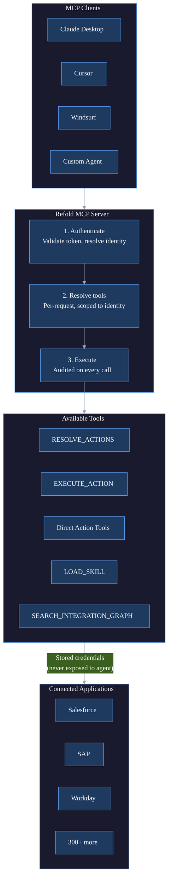
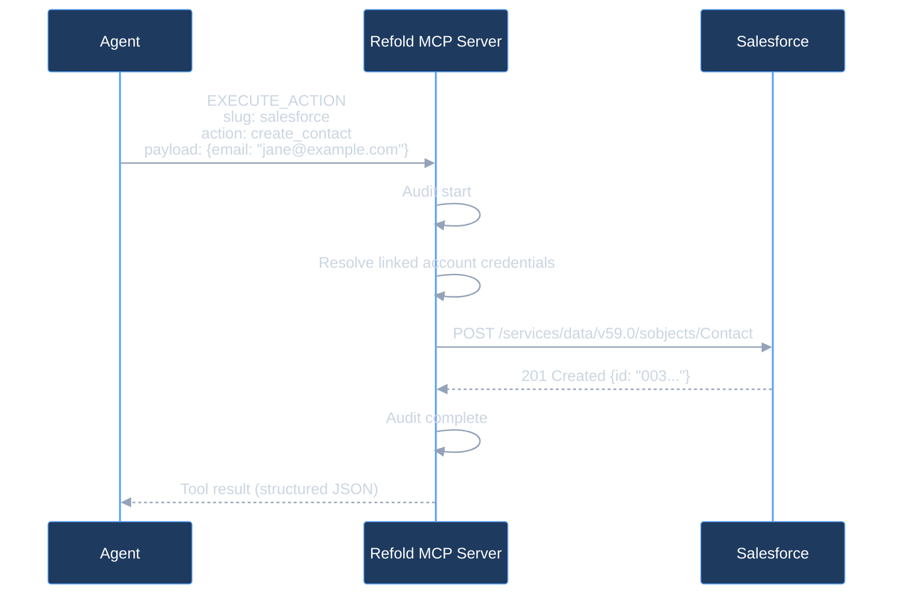

This page describes how the Refold MCP server handles a request end to end. It is intended for technical evaluators and developers building agents against Refold MCP servers.

## System overview

All clients connect over Streamable HTTP using MCP protocol version `2025-11-25`.



## Request lifecycle

Every request follows the same path regardless of mode.

### 1. Token validation

Refold extracts the token and server ID from the URL path and validates the token. The result is a per-request session context:

| Field | Description |
|-------|-------------|
| `org_id` | Organization this linked account belongs to |
| `linked_account_id` | The specific end-user connection |
| `environment` | `test` or `production` |
| `mcp_server_id` | Which MCP server configuration to use |
| `direct_mode` | `true` (default) or `false` (when `?mode=agent`) |
| `expose_skills` | `true` or `false` (when `?expose_skills=true`) |

This context is immutable for the lifetime of the request. It cannot be modified by tool handlers or downstream code.

### 2. Tool resolution

The tool set is resolved on every `tools/list` and `tools/call` request from the validated identity. Tools are not cached across requests, which means two concurrent sessions never share state.

**Direct mode** (default):
- Loads the MCP server configuration for this identity
- Reads the configured apps, their actions, and their workflows
- Exposes one tool per action and workflow with auto-generated names and fixed schemas
- Adds skill tools if `expose_skills=true`

**Agent mode** (`?mode=agent`):
- Exposes `RESOLVE_ACTIONS` and `EXECUTE_ACTION` as the primary tools
- Adds skill tools if `expose_skills=true`
- Does not create per-action tools

### 3. Tool execution

When an agent calls a tool, Refold:

1. Resolves the authenticated identity from the current request
2. Resolves the full tool set to find the requested tool
3. Records the invocation start (tool name, input, identity, client metadata)
4. Executes the tool
5. Records the invocation result (output, status, duration)
6. Returns the result to the agent

If the tool runs an integration action or workflow, Refold makes the actual call to the third-party application using the linked account's stored credentials. The agent never sees the credentials.

### 4. Action execution detail



## Statelessness

The MCP server holds no session state between requests. Identity, configuration, and credential data are resolved per-request. This is what makes horizontal scaling and tenant isolation work, and why instances can be added, replaced, or rolled back without disrupting active agents.

For the security model behind this — token validation, tenant isolation, audit guarantees — see [Security & Compliance](/v3/mcp-ai-agents/implementation/security-compliance).

## Direct mode tool naming

In direct mode, tool names are auto-generated from the app slug and action name:

```
{app_slug}_{action_name}_{type}
```

Examples:
- `salesforce_create_contact_action`
- `workday_get_workers_action`
- `hubspot_sync_leads_workflow`

Names are slugified (lowercased, special characters replaced with underscores) and deduplicated with numeric suffixes if collisions occur.

## Protocol details

| Property | Value |
|----------|-------|
| **MCP version** | v2025-11-25 |
| **Transport** | Streamable HTTP (stateless) |
| **Path pattern** | `/mcp/v1/{token}/{server_id}` |
| **Timeout** | 300 seconds per tool call (configurable per tool) |
