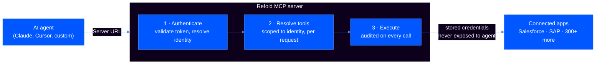
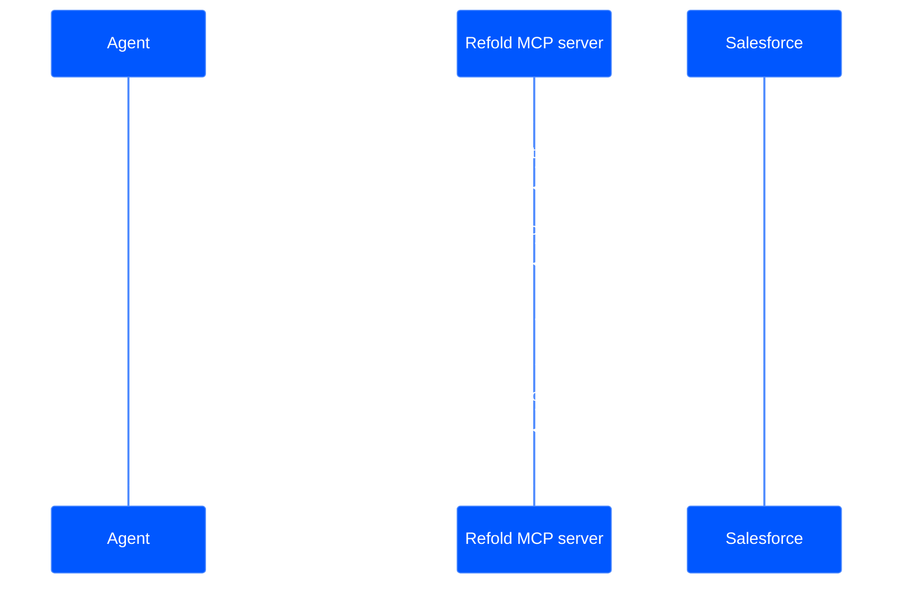

A Refold MCP server is a hosted endpoint that exposes your integrations to an AI agent as MCP tools. The agent connects with a Server URL, and Refold authenticates the request, resolves the tools that URL is allowed to use, and executes each call against the third-party app — all under a single end user's credentials.

This page covers the MCP-specific model: what an MCP server is built from, how your actions, workflows, and skills become tools, and the path a request takes from agent to app. For the decision of *which* tool pattern to expose, see [Choose your pattern](/v3/mcp-ai-agents/overview/choose-your-pattern).

## System overview

Every client connects over Streamable HTTP using MCP protocol version `2025-11-25`. Each request is authenticated, scoped to one identity, and audited.



## Core MCP objects

A Refold MCP server is built from objects you already configure in Refold. Three are MCP-specific; the rest are [platform objects](/v3/developer/configure/linked-account) you connect to from MCP.

- **MCP server** — a configuration unit in the dashboard under **Embedded Agents > MCP Servers**. It bundles a name, a set of connected apps and their actions, attached workflows and skills, the Agent Mode and Retrieve Skill toggles, and a generated Server URL. One MCP server is what an agent connects to. Create as many as you need — a common pattern is one server per use case, such as a "Sales Operations" server and a "Finance" server.
- **Tools** — the operations the agent can call. Refold generates them from the actions, workflows, and skills attached to the server (see [the object-to-tool model](#how-objects-become-tools)).
- **Skill** — a reusable procedure attached to an MCP server that tells the agent what to do, in what order, without moving the logic server-side. The agent still makes each tool call itself. See [Skills](/v3/mcp-ai-agents/skills/overview).

The objects an MCP server draws from live in Platform — link out rather than redefining them here:

- A [connector](/v3/developer/guide/build/connectors/overview) is the integration package for an app (Salesforce, SAP, Workday) — its OAuth flow, credentials, and the catalog of actions and workflows.
- A [linked account](/v3/developer/configure/linked-account) is one end user's connection to those apps. Its credentials are what every tool call runs under.
- A [platform workflow](/v3/developer/configure/workflows/overview) is a multi-step process you build once and can expose as a single MCP tool.

### How objects become tools

When an agent connects, Refold reads the server's configuration and exposes the selected actions, workflows, and skills as MCP tools. The mapping is direct:

| Refold object | Becomes | The agent sees |
|---------------|---------|----------------|
| **Action** (`create_contact`) | One tool with a fixed input schema | A callable tool, or — in agent mode — `RESOLVE_ACTIONS` → `EXECUTE_ACTION` |
| **Workflow** (`sync_leads`) | One tool that runs the whole workflow | A single call; steps, retries, and error paths stay server-side |
| **Skill** | A loadable procedure | `LOAD_SKILL`, when the Retrieve Skill toggle is on |

How actions appear depends on the server's mode. In direct mode, every selected action and workflow is exposed as its own tool. In agent mode, actions are reached through `RESOLVE_ACTIONS` and `EXECUTE_ACTION` instead. See [Choose your pattern](/v3/mcp-ai-agents/overview/choose-your-pattern) for the trade-offs.

## Request lifecycle

Every request follows the same path, regardless of mode.

### 1. Token validation

Refold extracts the token and server ID from the URL path and validates the token. The result is a per-request session context:

| Field | Description |
|-------|-------------|
| `org_id` | Organization this linked account belongs to |
| `linked_account_id` | The specific end-user connection |
| `environment` | `test` or `production` |
| `mcp_server_id` | Which MCP server configuration to use |
| `direct_mode` | `true` (default) or `false` (when `?mode=agent`) |
| `expose_skills` | `true` or `false` (when `?expose_skills=true`) |

This context is immutable for the lifetime of the request. Tool handlers and downstream code cannot modify it.

### 2. Tool resolution

The tool set is resolved on every `tools/list` and `tools/call` request from the validated identity. Tools are never cached across requests, so two concurrent sessions never share state.

- **Direct mode** (default) loads the server configuration, reads the selected apps, actions, and workflows, and exposes one tool per action and workflow with auto-generated names and fixed schemas. It adds skill tools when `expose_skills=true`.
- **Agent mode** (`?mode=agent`) exposes `RESOLVE_ACTIONS` and `EXECUTE_ACTION` as the primary tools and does not create per-action tools. It adds skill tools when `expose_skills=true`.

### 3. Tool execution

When an agent calls a tool, Refold:

1. Resolves the authenticated identity from the current request
2. Resolves the full tool set to find the requested tool
3. Records the invocation start (tool name, input, identity, client metadata)
4. Executes the tool
5. Records the invocation result (output, status, duration)
6. Returns the result to the agent

If the tool runs an action or workflow, Refold makes the call to the third-party app using the linked account's stored credentials.

<Warning>
The agent never sees a linked account's credentials. Refold resolves them server-side at execution time and they never enter the tool input or output.
</Warning>

The sequence below shows a single `EXECUTE_ACTION` call against Salesforce.



## Statelessness

The MCP server holds no session state between requests. Identity, configuration, and credential data are resolved per request. This is what makes horizontal scaling and tenant isolation work, and why instances can be added, replaced, or rolled back without disrupting active agents.

For the security model behind this — token validation, tenant isolation, and audit guarantees — see [Security & compliance](/v3/mcp-ai-agents/implementation/security-compliance).

## Direct mode tool naming

In direct mode, tool names are generated from the app slug and action name:

```
{app_slug}_{action_name}_{type}
```

For example:

- `salesforce_create_contact_action`
- `workday_get_workers_action`
- `hubspot_sync_leads_workflow`

Names are slugified (lowercased, special characters replaced with underscores) and deduplicated with numeric suffixes when collisions occur.

## Protocol details

| Property | Value |
|----------|-------|
| **MCP version** | `2025-11-25` |
| **Transport** | Streamable HTTP (stateless) |
| **Path pattern** | `/mcp/v1/{token}/{server_id}` |
| **Timeout** | 300 seconds per tool call (configurable per tool) |

## See also

- [Choose your pattern](/v3/mcp-ai-agents/overview/choose-your-pattern) — direct, agent, and workflow tool patterns
- [Server configuration](/v3/mcp-ai-agents/overview/server-configuration) — set up an MCP server in the dashboard
- [Tools](/v3/mcp-ai-agents/tools-reference/tools) — full tool reference and schemas
- [Authentication](/v3/mcp-ai-agents/authentication) — the Server-URL token and access toggles
- [MCP Logs](/v3/mcp-ai-agents/security/mcp-logs) — what each invocation records
