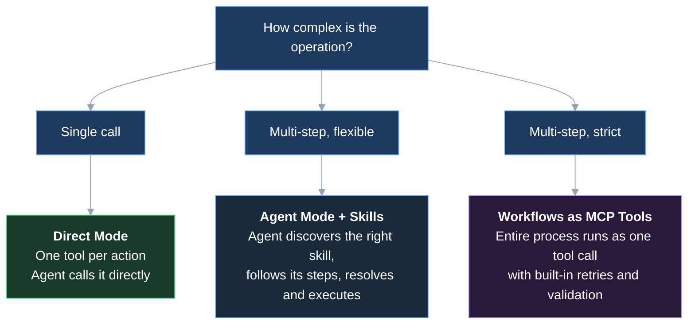

Refold MCP gives you three patterns for exposing integration capability to an agent. Pick based on how much control you want over the agent's behavior and how strict the process needs to be.

## The three patterns

| Pattern | Agent decides | You define | Best for |
|---------|--------------|-----------|----------|
| **Direct mode** | Which tool to call and with what input | The exact set of available actions | Simple CRUD. Under 20 actions. |
| **Agent mode + Skills** | How to decompose the task, which skills to load | The procedures (skills) the agent can follow | Complex tasks where you want guidance but flexibility |
| **Workflows as MCP tools** | When to trigger the workflow | The full process: steps, error handling, retries, rollback | Business-critical processes where consistency matters more than flexibility |

## Direct mode

Each action and workflow you select on the server becomes its own MCP tool with a fixed schema. The agent sees the full list and calls them directly.

Direct mode is the default — leave the **Agent Mode** toggle off. See [Server Configuration](/v3/mcp-ai-agents/overview/server-configuration) for the toggle reference.

## Agent mode + Skills

Two meta-tools (`RESOLVE_ACTIONS`, `EXECUTE_ACTION`) let the agent resolve user intent first, then execute. Pair with skills to give the agent step-by-step procedures for multi-step operations.

Turn on the **Agent Mode** and **Retrieve Skill** toggles. See [Skills](/v3/mcp-ai-agents/skills/overview) for how to write procedures the agent can follow.

## Workflows as MCP tools

A workflow built in the Refold workflow builder is attached to the server and appears as a single tool the agent calls. The workflow handles sequencing, retries, and rollback internally. The agent receives one result.

See [Workflows](/v3/mcp-ai-agents/workflow-as-mcp/overview) for the full pattern.

## You can combine them

These patterns are not mutually exclusive. A single server can expose direct actions for simple lookups, skills for multi-step procedures, and workflows for mission-critical processes. The toggles are independent.

## Next steps

<CardGroup cols={2}>
  <Card title="Quickstart" icon="play" href="/v3/mcp-ai-agents/overview/getting-started">
    Set up your first MCP server
  </Card>
  <Card title="Server Configuration" icon="gear" href="/v3/mcp-ai-agents/overview/server-configuration">
    The toggles and tabs reference
  </Card>
</CardGroup>
