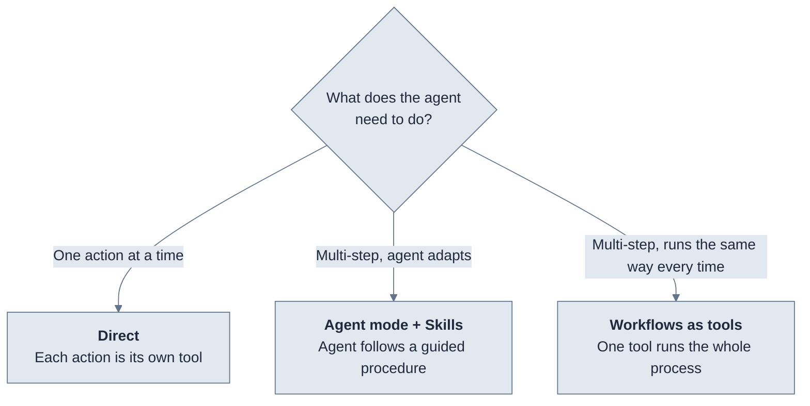

Refold MCP exposes your integrations to an agent in three patterns: **direct**, **agent mode with skills**, and **workflows as tools**. They differ in one thing — how much of the work the agent decides versus how much you define ahead of time. Pick based on how complex the operation is and how much control you need over how it runs.

The patterns are not exclusive. A single MCP server can use all three at once, because each is controlled by an independent toggle. Most production servers do.

## How to choose

Start from the operation the agent needs to perform.

## Compare the patterns

| | Direct | Agent mode + Skills | Workflows as tools |
|--|--------|---------------------|--------------------|
| **Agent decides** | Which tool to call, with what input | How to break down the task and which skill to load | When to call the workflow |
| **You define** | The exact set of exposed actions | The procedures (skills) the agent can follow | The full process: steps, sequencing, retries, rollback |
| **Sequencing & error handling** | Agent handles it | Defined in the skill, agent executes | Runs server-side, agent never sees the steps |
| **Best for** | Simple, single-call operations | Multi-step tasks that need guidance but room to adapt | Business-critical processes that must run the same way every time |
| **Server toggle** | Default (all toggles off) | **Agent Mode** + **Retrieve Skill** on | Attach a workflow to the server |

## Direct

Each action and workflow you select becomes its own MCP tool with a fixed input schema. The agent sees the full list and calls a tool directly with the parameters it chooses.

Direct is the default and the tightest scope: the agent can only call the specific actions you exposed. Use it for simple CRUD — create a record, query data, update a field — and when the action set is small enough that the agent can reason over the full list.

Direct mode is on whenever the **Agent Mode** toggle is off. See [Server configuration](/v3/mcp-ai-agents/overview/server-configuration) for the toggle reference and how to select actions.

## Agent mode + Skills

Agent mode replaces per-action tools with two meta-tools, `RESOLVE_ACTIONS` and `EXECUTE_ACTION`. The agent resolves a user's natural-language intent into the right actions first, then executes them. This scales past the point where a long flat list of direct tools becomes unwieldy.

Pair it with skills to hand the agent tested, step-by-step procedures for multi-step operations — the agent follows your steps but still adapts to the specific request. Turn on the **Agent Mode** and **Retrieve Skill** toggles.

Use this when a task spans several calls and you want to guide the agent without locking the process down. See [Skills](/v3/mcp-ai-agents/skills/overview) for how to write the procedures an agent loads and follows.

## Workflows as tools

A [workflow](/v3/developer/configure/workflows/overview) you build in Refold attaches to the server and appears as a single tool. The agent calls it once with input; the workflow handles sequencing, retries, and rollback server-side, then returns one result. The agent never touches the intermediate steps.

Use this for business-critical processes where consistency matters more than flexibility — anything with approvals, compliance checks, or a strict order of operations. See [Workflows as tools](/v3/mcp-ai-agents/workflow-as-mcp/overview) for how to attach a workflow and what it guarantees.

## Combine them

The three toggles are independent, so one server can expose all three patterns at once:

- **Direct actions** for simple lookups the agent calls ad hoc
- **Skills** for multi-step procedures where the agent needs guidance
- **Workflows** for the few processes that must run identically every time

A common setup is direct actions plus one or two workflows for the high-stakes operations, with skills added later when you notice the agent struggling with multi-step tasks. Each pattern is governed by its own toggle in [Server configuration](/v3/mcp-ai-agents/overview/server-configuration).

## Next steps

<CardGroup cols={3}>
  <Card title="Skills" icon="pen" href="/v3/mcp-ai-agents/skills/overview">
    Write procedures the agent loads and follows
  </Card>
  <Card title="Workflows as tools" icon="diagram-project" href="/v3/mcp-ai-agents/workflow-as-mcp/overview">
    Run a whole process as one tool call
  </Card>
  <Card title="Server configuration" icon="gear" href="/v3/mcp-ai-agents/overview/server-configuration">
    The toggles that turn each pattern on
  </Card>
</CardGroup>
