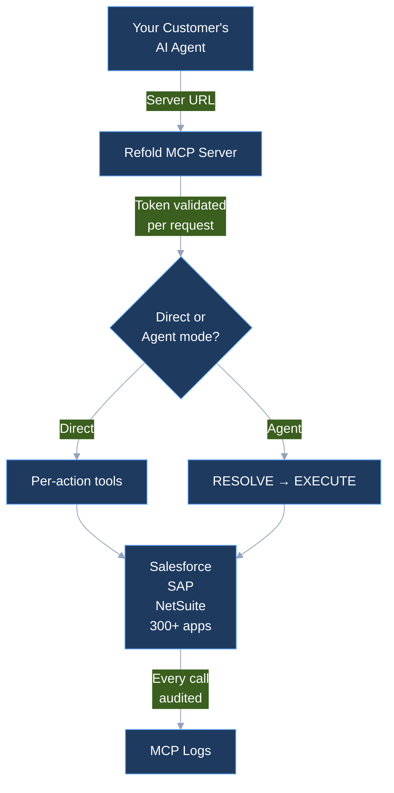

The [Model Context Protocol](https://modelcontextprotocol.io) is an open standard for connecting AI agents to external systems and data. Refold MCP lets SaaS platforms expose their integrations to AI agents over MCP. You configure an MCP server in the Refold dashboard, connect the enterprise apps your customers use, and hand them a URL. Their AI agents connect to that URL and get access to integration actions they can discover and call.

No custom integration code. No agent framework. Refold handles authentication, execution, tenant isolation, and audit logging.

<CardGroup cols={3}>
  <Card title="300+ Connectors" icon="plug">
    Salesforce, SAP, NetSuite, Workday, HubSpot, and hundreds more
  </Card>
  <Card title="Full Audit Trail" icon="clipboard-list">
    Every tool call logged with identity, input, output, and timing
  </Card>
  <Card title="Tenant Isolation" icon="shield">
    Per-request identity resolution. No shared state across sessions.
  </Card>
</CardGroup>

## How it works

<Steps>
  <Step title="Create an MCP server">
    Go to **Embedded Agents > MCP Servers** and create a new server. Give it a name and description that tells the agent what it can do.
  </Step>
  <Step title="Add applications">
    Attach the apps your customers need (Salesforce, SAP, NetSuite, etc.). Select which actions and workflows to expose.
  </Step>
  <Step title="Choose your mode">
    **Direct mode** exposes each action as its own tool. **Agent mode** uses two meta-tools that let the agent resolve intent before executing. See [Tools Reference](/v3/mcp-ai-agents/tools-reference/tools) for details.
  </Step>
  <Step title="Connect">
    Copy the Server URL and register it in any MCP client. The agent authenticates via the token in the URL and starts calling tools.
  </Step>
</Steps>

## What the agent can do

Once connected, an agent can:

- **Call integration actions** directly: create records, query data, update fields across connected apps
- **Run workflows** as single tool calls with built-in error handling and retry logic
- **Discover skills** to find pre-built procedures for complex multi-step operations
- **Work across multiple apps** in a single session (e.g., read from Salesforce, write to SAP)

Every tool call is authenticated and logged in [MCP Logs](/v3/mcp-ai-agents/security/mcp-logs).

## Two operating modes

| Mode | How it works | Best for |
|------|-------------|----------|
| **Direct** (default) | Each app action becomes its own tool | Simple setups with a small number of actions |
| **Agent** | Two meta-tools (`RESOLVE_ACTIONS` + `EXECUTE_ACTION`) let the agent resolve what to call first, then execute | Servers with many actions across multiple apps |

## Three patterns to choose from

Refold MCP exposes integrations to an agent in one of three ways: **direct mode** (one tool per action), **agent mode + skills** (the agent resolves intent and follows your procedures), or **workflows as MCP tools** (the agent calls one tool that runs the whole process server-side). Most servers combine all three.

See [Choose your pattern](/v3/mcp-ai-agents/overview/choose-your-pattern) for the decision framework.

## Next steps

<CardGroup cols={3}>
  <Card title="Quickstart" icon="play" href="/v3/mcp-ai-agents/overview/getting-started">
    Set up your first MCP server and connect from Claude or Cursor
  </Card>
  <Card title="Connect from agent code" icon="code" href="/v3/mcp-ai-agents/overview/connect-from-agent-code">
    Wire the Server URL into Anthropic, OpenAI Agents, Vercel AI, LangChain, or Mastra
  </Card>
  <Card title="Choose your pattern" icon="route" href="/v3/mcp-ai-agents/overview/choose-your-pattern">
    Direct mode, skills, or workflows — pick how much guidance your agent gets
  </Card>
  <Card title="How it works" icon="sitemap" href="/v3/mcp-ai-agents/overview/architecture">
    How the server processes requests and executes actions
  </Card>
  <Card title="MCP Logs" icon="clipboard-list" href="/v3/mcp-ai-agents/security/mcp-logs">
    Audit trail for every tool call
  </Card>
</CardGroup>
