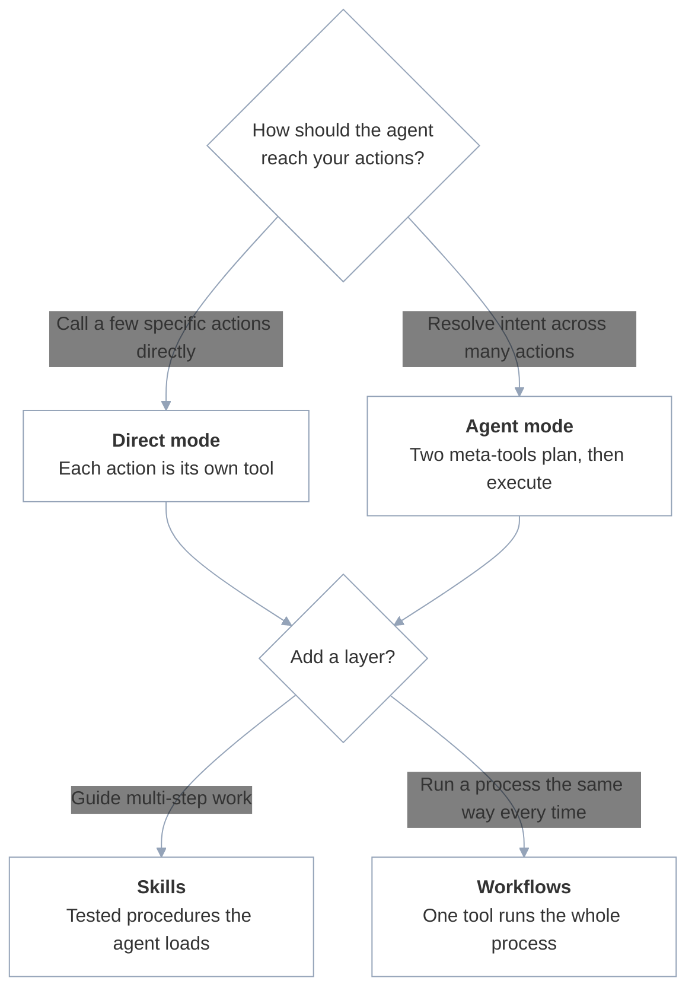

Configuring an MCP server is two decisions in one place: the **access pattern** — how much the agent decides at runtime versus what you define ahead of time — and the concrete setup across three dashboard tabs, **Overview**, **Applications**, and **Skills**. Start with the pattern, then apply it with the toggles and app selections in each tab.

## Choose an access pattern

Every Refold MCP server comes down to one question: how much of the work does the agent decide at runtime, and how much do you define ahead of time? You answer it with one **mode**, **direct** or **agent**, then optional **layers**: **skills** for guided procedures and **workflows** for fixed processes. A mode plus its layers is your pattern.

Mode is exclusive, but layers stack. A server in either mode can also expose skills, workflows, or both. Many servers settle on one mode and add a workflow or two for the high-stakes processes.



### Compare modes and layers

The first two columns are modes, and you pick one. The last two are layers you can add to either mode.

| | Direct mode | Agent mode | Skills | Workflows |
|--|--------|---------------------|--------|----------|
| **What the agent sees** | One tool per action or workflow | Two meta-tools: `RESOLVE_ACTIONS` and `EXECUTE_ACTION` | A skill index and loader: `GET_KNOWLEDGE_INDEX` and `LOAD_SKILL` | One tool per attached workflow |
| **Agent decides** | Which tool to call, with what input | The intent to resolve, then runs each action in the returned plan | Which skill to load, then follows it | When to call the workflow |
| **You define** | The exact set of exposed actions | The action set the agent resolves over | The procedures (skills) the agent can follow | The full process: steps, sequencing, and error handling |
| **Best for** | A few single-call operations | Large action sets and intent resolution | Multi-step tasks that need guidance but room to adapt | Processes that must run the same way every time |
| **Turn it on** | Default (**Agent Mode** off) | **Agent Mode** on | **Retrieve Skill** on, in either mode | Attach a workflow to the server |

### Direct mode

In direct mode, each action or workflow you select becomes its own MCP tool with a fixed input schema (named like `salesforce_create_contact_action`). The agent sees the full list and calls a tool directly with the parameters it chooses.

Direct is the default and gives the tightest scope: the agent can only call the specific actions you exposed. Use it for simple CRUD (create a record, query data, update a field) and when the action set is small enough that the agent can reason over the full list. It is on whenever the **Agent Mode** toggle in the [Overview tab](#access-controls) is off; you pick the exposed actions in the [Applications tab](#applications-tab).

### Agent mode

In agent mode, Refold replaces per-action tools with two meta-tools, `RESOLVE_ACTIONS` and `EXECUTE_ACTION`. The agent passes a user's natural-language intent to `RESOLVE_ACTIONS`, which returns a plan of the right actions, then calls `EXECUTE_ACTION` to run each one. This scales past the point where a long flat list of direct tools becomes unwieldy.

Turn it on with the **Agent Mode** toggle. Use it when the server exposes many actions, or when you want the agent to map free-form requests onto your action set instead of choosing from a fixed tool list.

<Note>
The agent always calls `RESOLVE_ACTIONS` first and `EXECUTE_ACTION` second. `RESOLVE_ACTIONS` returns the plan, and `EXECUTE_ACTION` runs an action from it. If nothing matches, `RESOLVE_ACTIONS` returns a short message instead of a plan.
</Note>

### Skills

Skills give the agent tested, step-by-step procedures for multi-step work. A skill is a markdown document, either a procedure hint or a reference doc, that the agent loads as content and follows while adapting to the specific request. Skills layer onto either mode, not just agent mode.

Turn on the **Retrieve Skill** toggle. It adds two tools: `GET_KNOWLEDGE_INDEX`, which returns the skill index (a compact list of the skills on the server), and `LOAD_SKILL`, which loads the full document for an entry by ID. The agent browses the index, loads the skill it needs, then carries out the steps with the action tools the mode exposes.

Use skills when a task spans several calls and you want to guide the agent without locking the process down. See [Attach Skills](/v3/mcp/build/skills) for how to write the procedures an agent loads and follows.

### Workflows as tools

A [workflow](/v3/workflows/overview) you build in Refold attaches to the server and appears as a single tool, in either mode. The agent calls it once with input, the workflow handles sequencing and error handling server-side, then returns one result. The agent never touches the intermediate steps.

Use workflows for business-critical processes where consistency matters more than flexibility, such as anything with approvals, compliance checks, or a strict order of operations. See [Expose Workflows as Tools](/v3/mcp/build/workflow-as-mcp) for how to attach a workflow and what it guarantees.

### Combine them

Pick one mode, then add the layers you need:

- **Mode** sets how the agent reaches your actions, by direct calls or resolved intent. Pick one.
- **Skills** add guided procedures the agent loads and follows. Available in either mode.
- **Workflows** add fixed processes that run the same way every time. Available in either mode.

A common setup is direct mode plus one or two workflows for the high-stakes processes, with the **Retrieve Skill** toggle added later when you notice the agent struggling with multi-step tasks. A larger action set tends toward agent mode, with skills layered on for the procedures that need guidance. You set the mode and skill exposure in the [Overview tab](#access-controls) below, select the actions in the [Applications tab](#applications-tab), and attach workflows as [tools](/v3/mcp/build/workflow-as-mcp).

## Overview tab

<Frame>
  
</Frame>

### Name and description

The **Name** and **Description** are surfaced to the agent when it connects. Write them for the agent, not for humans. Be specific about which apps and actions are available so the agent knows what it can do.

### Server URL

Each end user connects with their own Server URL. The URL comes in two forms that carry the same token and `server_id`: the token in the path, or the token in an `Authorization` header.

<CodeGroup>
```bash Path token
https://<domain>/mcp/v1/<token>/<server_id>
```

```bash Authorization header
https://<domain>/mcp/v1/<server_id>
# Authorization: Bearer <token>
```
</CodeGroup>

| Segment | What it is |
|---------|------------|
| `token` | Auth token tied to a specific [linked account](/v3/concepts/linked-account). It goes in the URL path or in an `Authorization: Bearer` header. Each end user gets a unique token. |
| `server_id` | Identifies this MCP server configuration. |

The token authenticates every request. It scopes the session to one end user's linked account, and every tool call in that session runs under that end user's credentials.

You build one server configuration and reuse it for every end user. Because each URL is unique to an end user, one URL maps to one [linked account](/v3/concepts/linked-account), which maps to one end user. For how Refold issues and stores per-user URLs in production, see [How it works](/v3/mcp/overview). For token security, revocation, and per-user scoping, see [Authentication](/v3/authentication/mcp).

<Info>
The Server URL is generated per linked account and retrieved from the dashboard. The examples above show its structure; copy the complete URL, including the host, from there rather than assembling it by hand.
</Info>

### Access controls

The **Agent Mode** toggle switches between the two modes described in [Choose an access pattern](#choose-an-access-pattern) above. Two more toggles layer capabilities onto whichever mode is active; neither is a third mode.

| Toggle | What it does | Default |
|--------|----------------|---------|
| **Agent Mode** | Switches the server from direct mode to agent mode, replacing per-action tools with `RESOLVE_ACTIONS` and `EXECUTE_ACTION`. | Off |
| **Retrieve Skill** | Adds `GET_KNOWLEDGE_INDEX` (the skill index) and `LOAD_SKILL`. The agent browses the index of skills attached to this server, then loads the full procedure it needs. Works in either mode. See [Attach Skills](/v3/mcp/build/skills). | Off |
| **Auth Tool** | Adds a reconnect prompt. If a connection needs re-authorization, the end user is prompted to reconnect instead of the call failing silently. See [Authentication](/v3/authentication/mcp). | Off |

<Note>
The **Agent Mode** and **Retrieve Skill** toggles change which tools the agent sees and how it invokes actions. They also change what the agent can reach in a session, so review the security model before enabling them. See [Authentication](/v3/authentication/mcp).
</Note>

<Tip>
Start with direct mode and a small set of actions. Enable Agent Mode when you need broader coverage, or when there are too many actions to expose as individual tools.
</Tip>

### Other settings

| Setting | What it does |
|---------|-------------|
| **Prompt suggestions** | Sample prompts shown in the embedded chat widget. Guides end users toward valid operations. |
| **Client setup** | Quick-reference connection instructions for different MCP clients. |
| **Embed chat** | Iframe snippet and standalone Chat URL for embedding the agent in your application. |
| **Debug mode** | Shows full request and response payloads in the embedded chat. Enable during development; disable in production. |

## Applications tab

<Frame>
  
</Frame>

The **Applications** tab lists the apps connected to this server and defines the agent's access boundary. Only apps added here are reachable. Only the actions you select within each app are exposed as tools.

Each app must be:

1. **Configured** in your Refold account with valid auth settings. See the [connector setup guide](/v3/connectors/supported-apps-actions).
2. **Authorized** by the linked account. The end user must have completed the auth flow for that app.

You can connect multiple apps to a single server. A server with Salesforce, SAP, and NetSuite gives the agent access to CRM, ERP, and financial actions in one session.

<Note>
Adding an app does not expose all of its actions. You select which actions to expose when you add the app, so only expose what agents actually need.
</Note>

## Skills tab

<Frame>
  
</Frame>

The **Skills** tab manages the reusable procedures attached to this server. Skills give the agent step-by-step guidance for complex multi-step operations instead of letting it determine the approach on its own.

Skills attached here are scoped to this MCP server only. See [Attach Skills](/v3/mcp/build/skills) to learn how to create and manage them.
