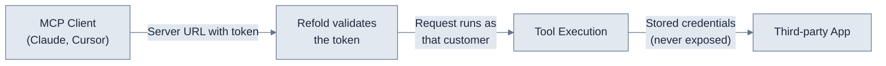

MCP authentication builds on Refold [linked accounts](/v3/platform/concepts/linked-account). Every MCP server connection carries a token that identifies one linked account, and Refold validates it on every request. The same model that connects your customers' third-party accounts also authenticates their agents. See [Linked accounts](/v3/platform/concepts/linked-account) for how those accounts and their credentials are established.

This page covers what is MCP-specific: the auth token, how access is scoped to the apps and actions you expose, and how to revoke a token. For the connection flows that produce a linked account in the first place (hosted, build-your-own, re-authentication, and more), see the [authentication hub](/v3/platform/authentication/overview).

<Note>
In MCP, the user authorizes connections **inline in the agent chat**. The flows are the same as every other Refold product; only the entry point differs.
</Note>

## How authentication works

An MCP client (Claude, Cursor, your own agent) connects to your MCP server with an auth token. You can embed the token in the URL path or send it in an Authorization header. Either way, the token resolves to a single linked account, and that account is the customer the request runs as for the rest of the call.



The agent never handles third-party credentials. Refold resolves the linked account's stored OAuth tokens and API keys internally when a tool executes, so credentials stay encrypted at rest and are never returned in tool inputs or outputs. For where those credentials come from, see [Connectors](/v3/developer/guide/build/connectors/overview); for how end users authorize them, see the [hosted auth flow](/v3/platform/authentication/connection-flows/hosted-flow).

### Pass the token in the URL or a header

You connect one of two ways, both pointing at the same MCP server:

- **Token in the URL path** embeds the token directly in the path.
- **Authorization header** keeps the token out of the URL and sends it as `Authorization: Bearer <token>`.

<CodeGroup>
```text Token in the URL path
https://<domain>/mcp/v1/<token>/<server_id>
```

```text Authorization header
https://<domain>/mcp/v1/<server_id>
Authorization: Bearer <token>
```
</CodeGroup>

## The auth token

| Property | Detail |
|----------|--------|
| **Token type** | Linked account token (opaque, server-generated) |
| **Validation** | Every request is validated against Refold |
| **Identity** | Resolves to a single linked account, the customer the request runs as |
| **Token scope** | One token per linked account per MCP server |

The token state is checked on every request, so there is no cached validation window.

<Warning>
Your token carries the same access wherever it travels, in the URL path or an Authorization header. Treat it as a secret: store it like an API key and rotate it the same way. A leaked token grants the same access it carries.
</Warning>

### Issue one URL per end user

Each token is scoped to a single linked account, so issue a separate Server URL for each end user rather than sharing one across users. Two users connecting to the same MCP server with different tokens see the same tool set but operate on their own credentials and data. There is no cross-account access within a session.

<Note>
Per-user tokens are what make revocation precise. When you issue one URL per user, cutting off a single user never affects anyone else connected to the same server.
</Note>

### Status codes

A successful tool call returns `{"success": true, "data": ...}`. A failed call returns `{"success": false, ...}`. Authentication problems surface as an HTTP status code before any tool runs, so this is where you confirm a token is wired up correctly:

| Status | Meaning |
|--------|---------|
| **401** | Missing token or server ID |
| **403** | Invalid or expired token |
| **404** | Server is disabled |
| **503** | Token validation is temporarily unavailable (the request fails closed) |

## Control which apps and actions an agent can reach

A token authenticates the agent; the MCP server's configuration decides what that agent can do. Set access on the server itself rather than in the agent.

| Control | How |
|---------|-----|
| **Which apps an agent can access** | Add or remove apps on the MCP server's **Applications** tab |
| **Which actions are available** | Select specific actions per app when adding it to the server |
| **Direct vs agent mode** | Toggle **Agent Mode** to control whether agents see raw tools or resolve-then-execute |
| **Skill access** | Toggle **Retrieve Skill** to control whether agents can discover and load skills |
| **Per-user scoping** | Each linked account gets a unique token, so each user connects with a different URL |

For where these toggles live in the dashboard, see [Server configuration](/v3/mcp/build/server-configuration). For how the modes change what the agent sees, see [How it works](/v3/mcp/get-started/architecture).

## Revoke access

When a Server URL leaks or you need to cut off a user, revoke at the linked-account level.

<Steps>
  <Step title="Regenerate the token to invalidate one URL">
    Regenerate the linked account token in the Refold dashboard. The old token becomes invalid immediately, and every request using it returns HTTP 403. Issue the new Server URL to the user to restore access.
  </Step>
  <Step title="Delete the linked account to revoke everywhere">
    Delete the linked account to revoke all of that end user's tokens across every MCP server they were connected to.
  </Step>
</Steps>

Because token state is checked on every request, revocation takes effect on the next call. There is no cached validation window to wait out.

## See also

- [Linked accounts](/v3/platform/concepts/linked-account): the account and credential model MCP authentication builds on
- [Connectors](/v3/developer/guide/build/connectors/overview): where the underlying OAuth and API-key credentials are configured
- [Hosted auth flow](/v3/platform/authentication/connection-flows/hosted-flow): how end users connect their accounts in the first place
- [Server configuration](/v3/mcp/build/server-configuration): where to set the app, action, and mode toggles
- [Security & compliance](/v3/mcp/operate/security-compliance): tenant isolation, transport security, and data handling
- [MCP Logs](/v3/mcp/operate/mcp-logs): the audit trail for every authenticated tool call
