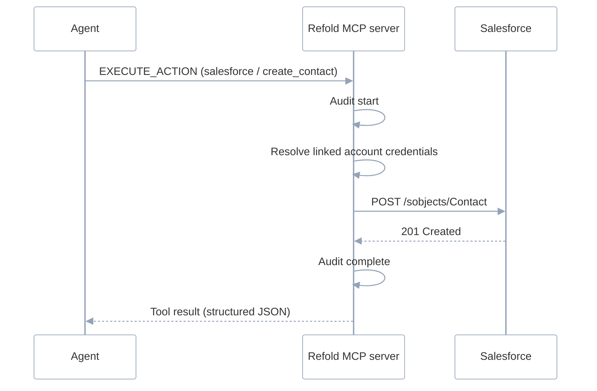

A Refold MCP server is a hosted endpoint that exposes your integrations to an AI agent as MCP tools. The agent connects with a Server URL. Refold authenticates the request, resolves the tools that URL exposes, and executes each call against the third-party app, all under a single end user's credentials.

The sections below explain what an MCP server is built from, how your actions, workflows, and skills become tools, and the path a request takes from agent to app. For the decision of *which* tool pattern to expose, see [Choose your pattern](/v3/mcp/get-started/choose-your-pattern).

## Core MCP objects

A Refold MCP server is built from objects you already configure in Refold. Three are MCP-specific; the rest are [platform objects](/v3/concepts/linked-account) you connect to from MCP.

- **MCP server** is a configuration unit in the dashboard under **Embedded Agents > MCP Servers**. It bundles a name, a set of connected apps and their actions, attached workflows and skills, the Agent Mode and Retrieve Skill toggles, and a generated Server URL. One MCP server is what an agent connects to. Create as many as you need. A common setup is one server per use case, such as a "Sales Operations" server and a "Finance" server.
- **Tools** are the operations the agent can call. Refold generates them from the actions, workflows, and skills attached to the server (see [the object-to-tool model](#how-objects-become-tools)).
- **Skill** is a reusable procedure attached to an MCP server that tells the agent what to do, in what order, without moving the logic server-side. The agent still makes each tool call itself. See [Skills](/v3/mcp/build/skills).

The objects an MCP server draws from live in the core Refold platform. Each links to its full reference:

- A [connector](/v3/platform/concepts/connector/supported-apps-actions) is the integration package for an app (Salesforce, SAP, Workday): its OAuth flow, credentials, and the catalog of actions and workflows.
- A [linked account](/v3/concepts/linked-account) is one end user's connection to those apps. Its credentials are what every tool call runs under.
- A [platform workflow](/v3/concepts/workflows/overview) is a multi-step process you build once and can expose as a single MCP tool.

### How objects become tools

When an agent connects, Refold reads the server's configuration and exposes the selected actions, workflows, and skills as MCP tools. The mapping is direct:

| Refold object | Becomes | The agent sees |
|---------------|---------|----------------|
| **Action** (`create_contact`) | One tool with a fixed input schema | A callable tool in direct mode, or `RESOLVE_ACTIONS` → `EXECUTE_ACTION` in agent mode |
| **Workflow** (`sync_leads`) | One tool that runs the whole workflow | A single call; steps, retries, and error paths stay server-side |
| **Skill** | A loadable procedure | `GET_KNOWLEDGE_INDEX` to browse, `LOAD_SKILL` to load, when the Retrieve Skill toggle is on |

How actions appear depends on the server's mode. In direct mode, every selected action and workflow is exposed as its own tool. In agent mode, actions and workflows are reached through `RESOLVE_ACTIONS` and `EXECUTE_ACTION` instead. See [Choose your pattern](/v3/mcp/get-started/choose-your-pattern) for the trade-offs.

## Request lifecycle

Every request follows the same path, regardless of mode.

### 1. Token validation

Refold validates the token and server ID on each request. A valid token scopes the request to exactly one linked account, so every tool call in that request runs under one end user's connection and one tenant's data, in the test or production environment the token belongs to. The mode and skill settings come from the MCP server's dashboard configuration, resolved server-side per request. This scope is fixed for the life of the request, and a tool call cannot widen it.

### 2. Tool resolution

Refold builds the tool list fresh for each request, from that request's server configuration. Nothing carries over between requests, so two end users never see each other's tools or data. Which tools appear depends on the mode set for the server in the dashboard:

- **Direct mode** (default) exposes one tool per selected action and workflow, each with an auto-generated name and a fixed input schema.
- **Agent mode** exposes `RESOLVE_ACTIONS` and `EXECUTE_ACTION` instead of per-action tools.

When the Retrieve Skill toggle is on, the skill tools `GET_KNOWLEDGE_INDEX` (which lists the server's skills) and `LOAD_SKILL` (which loads one) are added in either mode.

### 3. Tool execution

When an agent calls a tool, Refold:

1. Confirms the request's linked account and finds the requested tool
2. Logs the call (tool name, input, and who made it) before running it
3. Runs the tool, calling the third-party app under the linked account's stored credentials when the tool is an action or workflow
4. Logs the result (output, status, and duration)
5. Returns the result to the agent as structured JSON

On success the agent gets `{"success": true, "data": ...}`. On failure it gets `{"success": false, ...}` with an error it can act on.

<Note>
The agent never sees a linked account's credentials. Refold resolves them server-side at execution time and they never enter the tool input or output.
</Note>

The sequence below shows a single `EXECUTE_ACTION` call against Salesforce.



## Statelessness

The MCP server keeps no session state between requests. Each request carries its own token, and Refold resolves the linked account, configuration, and credentials from scratch every time. Because no request depends on a previous one, Refold can serve many end users at once and update the service without interrupting connected agents.

For the security model behind this (token validation, tenant isolation, and audit guarantees), see [Security & compliance](/v3/mcp/operate/security-compliance).

## Direct mode tool naming

In direct mode, tool names are generated from the app slug, the action or workflow name, and the object type:

```
{app_slug}_{action_name}_{type}
```

For example:

- `salesforce_create_contact_action`
- `workday_get_workers_action`
- `hubspot_sync_leads_workflow`

Names are slugified (lowercased, special characters replaced with underscores) and deduplicated with numeric suffixes when collisions occur.

## Protocol details

| Property | Value |
|----------|-------|
| **MCP version** | `2025-11-25` |
| **Transport** | Streamable HTTP (stateless) |
| **URL (token in path)** | `/mcp/v1/<token>/<server_id>` |
| **URL (token in header)** | `/mcp/v1/<server_id>` with `Authorization: Bearer <token>` |
| **Timeout** | 300 seconds per tool call (configurable per tool) |

## See also

- [Choose your pattern](/v3/mcp/get-started/choose-your-pattern): direct, agent, and workflow tool patterns
- [Server configuration](/v3/mcp/build/server-configuration): set up an MCP server in the dashboard
- [Tools](/v3/mcp/reference/tools): the full tool reference and schemas
- [Authentication](/v3/mcp/connect/authentication): the Server-URL token and access toggles
- [MCP Logs](/v3/mcp/operate/mcp-logs): what each invocation records
