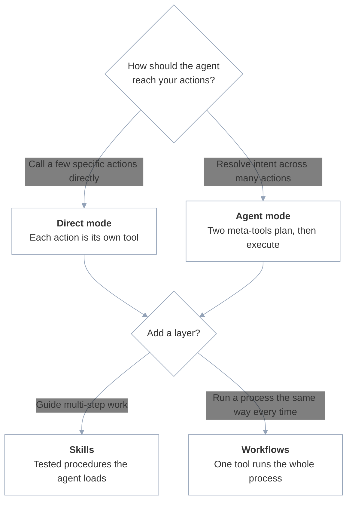

Refold MCP exposes your integrations to an agent through a **mode** and optional **layers**. A server runs in one of two modes, **direct** or **agent**, and the two are mutually exclusive: you pick one. On top of either mode you can add **skills** for guided procedures and **workflows** for fixed processes. Which you choose comes down to how much of the work the agent decides versus how much you define ahead of time.

Mode is exclusive, but layers stack. A server in either mode can also expose skills, attached workflows, or both. Many servers settle on one mode and add a workflow or two for the high-stakes processes.

## How to choose

Start from the operation the agent needs to perform.

## Compare the patterns

The first two columns are modes, and you pick one. The last two are layers you can add to either mode.

| | Direct mode | Agent mode | Skills | Workflows |
|--|--------|---------------------|--------|----------|
| **What the agent sees** | One tool per action or workflow | Two meta-tools: `RESOLVE_ACTIONS` and `EXECUTE_ACTION` | A skill index and loader: `GET_KNOWLEDGE_INDEX` and `LOAD_SKILL` | One tool per attached workflow |
| **Agent decides** | Which tool to call, with what input | Which actions resolve the intent, then runs them | Which skill to load, then follows it | When to call the workflow |
| **You define** | The exact set of exposed actions | The action set the agent resolves over | The procedures (skills) the agent can follow | The full process: steps, sequencing, and error handling |
| **Best for** | A few single-call operations | Large action sets and intent resolution | Multi-step tasks that need guidance but room to adapt | Processes that must run the same way every time |
| **Turn it on** | Default (**Agent Mode** off) | **Agent Mode** on | **Retrieve Skill** on, in either mode | Attach a workflow to the server |

## Direct mode

In direct mode, each action or workflow you select becomes its own MCP tool with a fixed input schema (named like `salesforce_create_record_action`). The agent sees the full list and calls a tool directly with the parameters it chooses.

Direct is the default and the tightest scope: the agent can only call the specific actions you exposed. Use it for simple CRUD (create a record, query data, update a field) and when the action set is small enough that the agent can reason over the full list.

Direct mode is on whenever the **Agent Mode** toggle is off. See [Server configuration](/v3/mcp/build/server-configuration) for the toggle reference and how to select actions.

## Agent mode

In agent mode, Refold replaces per-action tools with two meta-tools, `RESOLVE_ACTIONS` and `EXECUTE_ACTION`. The agent passes a user's natural-language intent to `RESOLVE_ACTIONS`, which returns a plan of the right actions, then calls `EXECUTE_ACTION` to run each one. This scales past the point where a long flat list of direct tools becomes unwieldy.

Agent mode is on when the **Agent Mode** toggle is on. Use it when an agent serves many actions, or when you want it to map free-form requests onto your action set instead of choosing from a fixed tool list.

<Note>
The agent always calls `RESOLVE_ACTIONS` first and `EXECUTE_ACTION` second. `RESOLVE_ACTIONS` returns the plan, and `EXECUTE_ACTION` runs an action from it. If nothing matches, `RESOLVE_ACTIONS` returns a short message instead of a plan.
</Note>

## Skills

Skills hand the agent tested, step-by-step procedures for multi-step work. A skill is a markdown document, either a procedure hint or a reference doc, that the agent loads as content and follows while adapting to the specific request. Skills layer onto either mode, not just agent mode.

Turn on the **Retrieve Skill** toggle. It adds two tools: `GET_KNOWLEDGE_INDEX`, which returns a compact index of the skills available on the server, and `LOAD_SKILL`, which loads the full document for an entry by id. The agent browses the index, loads the skill it needs, then carries out the steps with the action tools the mode exposes.

Use skills when a task spans several calls and you want to guide the agent without locking the process down. See [Skills](/v3/mcp/build/skills) for how to write the procedures an agent loads and follows.

## Workflows as tools

A [workflow](/v3/platform/concepts/workflows/overview) you build in Refold attaches to the server and appears as a single tool, in either mode. The agent calls it once with input, the workflow handles sequencing and error handling server-side, then returns one result. The agent never touches the intermediate steps.

Use workflows for business-critical processes where consistency matters more than flexibility, such as anything with approvals, compliance checks, or a strict order of operations. See [Workflows as tools](/v3/mcp/build/workflow-as-mcp) for how to attach a workflow and what it guarantees.

## Combine them

Pick one mode, then add the layers you need:

- **Mode** sets how the agent reaches your actions, by direct calls or resolved intent. Pick one.
- **Skills** add guided procedures the agent loads and follows. Available in either mode.
- **Workflows** add fixed processes that run the same way every time. Available in either mode.

A common setup is direct mode plus one or two workflows for the high-stakes processes, with the **Retrieve Skill** toggle added later when you notice the agent struggling with multi-step tasks. A larger action set tends toward agent mode, with skills layered on for the procedures that need guidance. Mode and skill exposure are toggles in [Server configuration](/v3/mcp/build/server-configuration), and workflows attach to the server there too.

## Next steps

<CardGroup cols={3}>
  <Card title="Skills" icon="pen" href="/v3/mcp/build/skills">
    Write procedures the agent loads and follows
  </Card>
  <Card title="Workflows as tools" icon="diagram-project" href="/v3/mcp/build/workflow-as-mcp">
    Run a whole process as one tool call
  </Card>
  <Card title="Server configuration" icon="gear" href="/v3/mcp/build/server-configuration">
    Set the mode and turn on each layer
  </Card>
</CardGroup>
