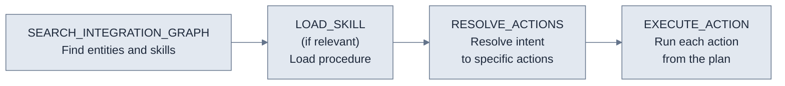

The tools an agent sees depend on which toggles are enabled on your [server configuration](/v3/mcp/get-started/architecture). For guidance on choosing between direct mode, agent mode, and skill tools, see [Choose your pattern](/v3/mcp/get-started/choose-your-pattern).

## Tool availability

| Tool | Available when | Purpose |
|------|---------------|---------|
| Per-action tools | Agent Mode **OFF** (default) | One tool per app action or workflow |
| `RESOLVE_ACTIONS` | Agent Mode **ON** | Resolves user intent to a list of specific actions |
| `EXECUTE_ACTION` | Agent Mode **ON** | Executes one action or workflow from a resolved plan |
| `SEARCH_INTEGRATION_GRAPH` | Retrieve Skill **ON** | Discovers entities, actions, and skills in the knowledge graph |
| `LOAD_SKILL` | Retrieve Skill **ON** | Loads the full content of a specific skill |
| `AUTH` | Auth Tool **ON** | Returns a re-auth link when a connected app's credentials are missing or expired |

---

## Direct mode

When Agent Mode is off, each action and workflow on the server becomes its own tool. Names are auto-generated from the app slug and action name.

**Example tool names:**
```
salesforce_create_contact_action
salesforce_list_deals_action
sap_get_purchase_order_action
hubspot_sync_leads_workflow
```

Each tool has a fixed schema. The `application_slug`, `action_id`, and `type` fields are pre-bound by Refold — the agent cannot change them. The agent supplies only the `input_payload`.

---

## Agent mode

When Agent Mode is on, per-action tools are replaced with two meta-tools: `RESOLVE_ACTIONS` and `EXECUTE_ACTION`.

### RESOLVE_ACTIONS

Takes the user's request and resolves it to a list of specific actions to run.

| Parameter | Type | Required | Description |
|-----------|------|----------|-------------|
| `integration_query` | `list[string]` | Yes | Action descriptions extracted from the user's request. Each entry describes one action. |

**Building `integration_query`:** Break the user's request into individual actions. Each entry should be a short description of the action and the target app.

**Example:**
```
User: "Get all my Salesforce contacts and create a note in HubSpot"

integration_query: [
  "List Contacts Salesforce",
  "Create Note HubSpot"
]
```

**Returns:** A list of resolved entities.

```json Output
[
  {
    "slug": "salesforce",
    "type": "action",
    "identifier": "get_contacts",
    "json_schema": {
      "type": "object",
      "properties": {
        "where": {"type": "string"},
        "order_by": {"type": "string"}
      }
    }
  },
  {
    "slug": "hubspot",
    "type": "action",
    "identifier": "create_note",
    "json_schema": { "...": "..." }
  }
]
```

| Field | Type | Description |
|-------|------|-------------|
| `slug` | `string` | Application slug (e.g., `salesforce`, `hubspot`) |
| `type` | `"action"` \| `"workflow"` | Whether the entity is an action or a workflow |
| `identifier` | `string` | The action or workflow ID — pass this as `action_id` to `EXECUTE_ACTION` |
| `json_schema` | `object` | JSON Schema for the action's input. Pass through to `input_payload`. May be `{}` if the entity has no inputs. |

### EXECUTE_ACTION

Runs a single action or workflow. Call once per resolved action from the `RESOLVE_ACTIONS` output.

| Parameter | Type | Required | Description |
|-----------|------|----------|-------------|
| `application_slug` | `string` | Yes | The app to run against (e.g., `"salesforce"`) |
| `action_id` | `string` | Yes | The action or workflow ID from the resolved plan |
| `input_payload` | `object` | Yes | Input fields for the action (e.g., `{"email": "user@example.com"}`) |
| `type` | `"action"` \| `"workflow"` | Yes | Whether this is an action or a workflow |

**Example call:**

```json
{
  "application_slug": "hubspot",
  "action_id": "create_contact",
  "input_payload": {
    "email": "jane@example.com",
    "firstname": "Jane",
    "lastname": "Doe"
  },
  "type": "action"
}
```

**Returns:** An object with the downstream result.

```json Output
{
  "success": true,
  "data": {
    "id": "contact_12345",
    "...": "downstream response from HubSpot, structure depends on the action"
  }
}
```

The shape of `data` is the third-party app's response passed through — it varies by action. On failure, a generic error is surfaced to the agent. The detailed upstream error is recorded in the audit log's `internal_error` field and is not returned to the agent.

---

## Skill tools

Available when Retrieve Skill is enabled. Skill tools can be combined with either direct or agent mode.

### SEARCH_INTEGRATION_GRAPH

Queries the integration knowledge graph for entities, actions, and skills.

| Parameter | Type | Default | Description |
|-----------|------|---------|-------------|
| `entity_name` | `string` | required | What to search for (e.g., `"Contacts"`, `"Purchase Orders"`) |
| `related_entity_name` | `string` | `null` | Optional second entity. When provided, the search returns how the two entities relate across connected apps. |
| `apps` | `list[string]` | `null` | Restrict the search to specific app slugs |
| `limit` | `int` | `25` | Maximum number of results to return |
| `min_confidence` | `float` | `0.5` | Drop results below this match score (0.0 – 1.0) |
| `depth` | `int` | `1` | How far to traverse from the starting entity. Higher values surface more distant relationships at the cost of relevance. |
| `max_response_chars` | `int` | `12000` | Cap on response size in characters |

<Tip>
Defaults are tuned for typical use. Most agents only need `entity_name` and optionally `apps`.
</Tip>

**Returns:** A rendered markdown string (not a structured object). The agent reads the markdown directly to find relevant entities, actions, and skills to call next.

### LOAD_SKILL

Loads the full content of a skill by ID or name. At least one parameter must be provided.

| Parameter | Type | Description |
|-----------|------|-------------|
| `skill_id` | `string` | The skill's ID (from `SEARCH_INTEGRATION_GRAPH` results or the Skills tab) |
| `skill_name` | `string` | Look up a skill by name instead of ID |

**Returns:**

```json Output
{
  "success": true,
  "results": [
    {
      "file_id": "<skill_id>",
      "snippet": "## Goal\nQualify an inbound lead...",
      "skill_name": "Lead Qualification",
      "category": "Sales",
      "apps": ["salesforce"],
      "skills_summary": "Score and route inbound leads"
    }
  ]
}
```

The full skill content is in `results[0].snippet`. Content over 100,000 characters is truncated with an explicit marker appended.

<Note>
`LOAD_SKILL` never raises an exception on failure — it returns `{"success": false, "error": "..."}`. The audit log records `success` for the tool call even when the agent received a logical failure. Inspect the response payload in the audit detail to verify whether the skill actually loaded.
</Note>

For how skills are surfaced to the agent at session start and the typical discovery flow, see [Skills](/v3/mcp/build/skills).

---

## AUTH

Available when the **Auth Tool** toggle is on.

The agent calls `AUTH` when a downstream action fails because a linked account's credentials for that app are missing or expired. The tool returns an authentication URL the end user can complete to reconnect the app, after which the agent retries the original action.

| Parameter | Type | Required | Description |
|-----------|------|----------|-------------|
| `application_slug` | `string` | Yes | The app the user needs to authenticate (e.g., `"salesforce"`) |

**Returns:** An object with the auth URL and a short message the agent can relay to the user.

**Recover flow:**

1. The agent calls an action (for example, `EXECUTE_ACTION` against Salesforce).
2. Refold returns an `EXECUTION_ERROR` with a credentials-missing status.
3. The agent calls `AUTH` with the app's slug.
4. `AUTH` returns an authentication URL.
5. The agent surfaces the URL to the end user.
6. After the user completes authentication, the agent retries the original action.

The failed first call and the eventual successful retry are both recorded in [MCP Logs](/v3/mcp/operate/mcp-logs) under the same Session ID.

For the underlying token and access model, see [Authentication](/v3/mcp/connect/authentication).

---

## Execution sequence

When both Agent Mode and Retrieve Skill are enabled, call the tools in this order:



<Note>
The tool descriptions enforce this ordering. Call `EXECUTE_ACTION` only after `RESOLVE_ACTIONS` returns a plan. Agents that skip `RESOLVE_ACTIONS` receive an error-guidance response from the tool description.
</Note>

## See also

- [Architecture](/v3/mcp/get-started/architecture) — how tools map to actions, workflows, and skills
- [Choose your pattern](/v3/mcp/get-started/choose-your-pattern) — when to use direct mode, agent mode, or skill tools
- [Skills](/v3/mcp/build/skills) — how agents discover and run multi-step procedures
- [Authentication](/v3/mcp/connect/authentication) — the token model and access toggles
- [MCP Logs](/v3/mcp/operate/mcp-logs) — per-call audit trail with input and output
