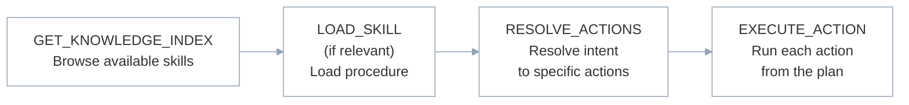

The tools an agent sees depend on which toggles are enabled on your [server configuration](/v3/mcp/build/server-configuration). For guidance on choosing between direct mode, agent mode, and skill tools, see [Choose an access pattern](/v3/mcp/build/server-configuration#choose-an-access-pattern).

## Tool availability

| Tool | Available when | Purpose |
|------|---------------|---------|
| Per-action tools | Agent Mode **OFF** (default) | One tool per app action or workflow |
| `RESOLVE_ACTIONS` | Agent Mode **ON** | Resolves user intent to a list of specific actions |
| `EXECUTE_ACTION` | Agent Mode **ON** | Executes one action or workflow from a resolved plan |
| `GET_KNOWLEDGE_INDEX` | Retrieve Skill **ON** | Returns a server-scoped index of the skills available to load |
| `LOAD_SKILL` | Retrieve Skill **ON** | Loads the full content of a specific skill |

---

## Direct mode

When Agent Mode is off, each action and workflow on the server becomes its own tool. Names are auto-generated from the app slug and the action or workflow name.

**Example tool names:**
```text
salesforce_create_contact_action
salesforce_list_deals_action
sap_get_purchase_order_action
hubspot_sync_leads_workflow
```

Each tool has a fixed schema. The target app, action, and type are pre-bound by Refold, so the agent cannot change them. It supplies only the action's input (`input_payload`).

---

## Agent mode

When Agent Mode is on, per-action tools are replaced with two meta-tools: `RESOLVE_ACTIONS` and `EXECUTE_ACTION`.

### RESOLVE_ACTIONS

Takes the user's request and resolves it to a list of specific actions to run.

| Parameter | Type | Required | Description |
|-----------|------|----------|-------------|
| `integration_query` | `list[string]` | Yes | Action descriptions extracted from the user's request. Each entry describes one action. |

**Building `integration_query`:** Break the user's request into individual actions. Each entry should be a short description of the action and the target app.

**Example:**
```text
User: "Get all my Salesforce contacts and create a note in HubSpot"

integration_query: [
  "List Contacts Salesforce",
  "Create Note HubSpot"
]
```

**Returns:** A list of resolved entities.

```json Output
[
  {
    "slug": "salesforce",
    "type": "action",
    "identifier": "get_contacts",
    "json_schema": {
      "type": "object",
      "properties": {
        "where": {"type": "string"},
        "order_by": {"type": "string"}
      }
    }
  },
  {
    "slug": "hubspot",
    "type": "action",
    "identifier": "create_note",
    "json_schema": { "...": "..." }
  }
]
```

| Field | Type | Description |
|-------|------|-------------|
| `slug` | `string` | Application slug (for example, `salesforce` or `hubspot`). Pass this as `application_slug` to `EXECUTE_ACTION`. |
| `type` | `"action"` \| `"workflow"` | Whether the entity is an action or a workflow |
| `identifier` | `string` | The action or workflow ID. Pass this as `action_id` to `EXECUTE_ACTION` |
| `json_schema` | `object` | JSON Schema for the action's input. Pass through to `input_payload`. May be `{}` if the entity has no inputs. |

<Note>
When nothing matches the request, `RESOLVE_ACTIONS` returns a plain string (for example, `"Couldn't find any matching actions..."`) instead of a list. Read the response as text before assuming a plan came back.
</Note>

### EXECUTE_ACTION

Runs a single action or workflow. Call once per resolved action from the `RESOLVE_ACTIONS` output.

| Parameter | Type | Required | Description |
|-----------|------|----------|-------------|
| `application_slug` | `string` | Yes | The app to run against (for example, `"salesforce"`) |
| `action_id` | `string` | Yes | The action or workflow ID from the resolved plan |
| `input_payload` | `object` \| `string` | Yes | Input fields for the action, as a JSON object or a JSON string (for example, `{"email": "user@example.com"}`) |
| `type` | `"action"` \| `"workflow"` | Yes | Whether this is an action or a workflow |

**Example call:**

```json
{
  "application_slug": "hubspot",
  "action_id": "create_contact",
  "input_payload": {
    "email": "jane@example.com",
    "firstname": "Jane",
    "lastname": "Doe"
  },
  "type": "action"
}
```

**Returns:** An object with the downstream result.

```json Output
{
  "success": true,
  "data": {
    "id": "contact_12345",
    "...": "downstream response from HubSpot, structure depends on the action"
  }
}
```

The shape of `data` is the third-party app's response passed through, so it varies by action. On failure, the agent receives an error message describing what went wrong, and the same detail is recorded in the audit log.

---

## Skill tools

Available when Retrieve Skill is enabled. Skill tools can be combined with either direct or agent mode.

### GET_KNOWLEDGE_INDEX

Returns a compact index of the skills available on this server. Despite the tool name, the "knowledge index" and the skill index are the same thing. The agent browses the index, then loads the full content of a specific entry with `LOAD_SKILL`.

| Parameter | Type | Default | Description |
|-----------|------|---------|-------------|
| `limit` | `int` | `50` | Maximum number of index entries to return |
| `offset` | `int` | `0` | Number of entries to skip, for paging through a long index |

**Returns:** The index of skills scoped to this server. Each entry carries the skill's ID and a short summary, so the agent can pick one and load it by ID with `LOAD_SKILL`.

### LOAD_SKILL

Loads the full content of a skill by ID or name. At least one parameter must be provided.

| Parameter | Type | Description |
|-----------|------|-------------|
| `skill_id` | `string` | The skill's ID (from `GET_KNOWLEDGE_INDEX` results or the Skills tab) |
| `skill_name` | `string` | Look up a skill by name instead of ID |

**Returns:**

```json Output
{
  "success": true,
  "results": [
    {
      "file_id": "<skill_id>",
      "snippet": "## Goal\nQualify an inbound lead...",
      "skill_name": "Lead Qualification",
      "category": "Sales",
      "apps": ["salesforce"]
    }
  ]
}
```

The full skill content is in `results[0].snippet`. Content over 100,000 characters is truncated with an explicit marker appended.

<Note>
`LOAD_SKILL` never throws. If a skill can't be loaded, the call still returns cleanly with `{"success": false, "error": "..."}`, so check the `success` field in the response before using the content.
</Note>

For how skills are surfaced to the agent at session start and the typical discovery flow, see [Skills](/v3/mcp/build/skills).

---

## Re-authorization

If a connection needs re-authorization (for example, an app's credentials have expired), the end user is prompted to reconnect through Refold's hosted flow. The agent does not handle or store credentials itself.

For the underlying token and access model, see [Authentication](/v3/authentication/mcp).

---

## Execution sequence

When both Agent Mode and Retrieve Skill are enabled, call the tools in this order:



<Note>
The tool descriptions instruct agents to follow this ordering and to call `EXECUTE_ACTION` only after `RESOLVE_ACTIONS` returns a plan. The ordering is guided by these descriptions, not enforced by a runtime check.
</Note>
