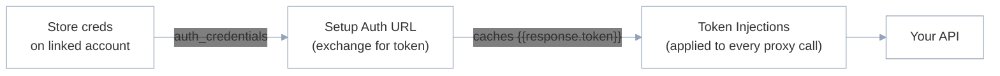

When Refold calls your app's API — to run an [API proxy](/v3/native/configure/developer/api-proxies) or write data back into your system — it has to authenticate as the customer whose data it's touching. **My App authentication** is where you set that up once: you store each customer's credentials on their [linked account](/v3/concepts/linked-account), optionally exchange them for a short-lived token, and Refold injects the result into every API proxy call automatically.

Configure it in the Console under **Developer > Authentication**.

<Note>
This is the *outbound* direction — Refold authenticating **to your API**. To connect your customers' **third-party** accounts (HubSpot, Salesforce, and so on), see [Authentication](/v3/platform/authentication/overview) instead.
</Note>

## How it works

Authentication runs in three stages, each configured on the Authentication screen:

1. **Store credentials** — save each customer's credentials on their linked account under `your_app.auth_credentials`.
2. **Exchange for a token** *(optional)* — if your API is token-based, Refold calls your token endpoint to trade those credentials for a short-lived access token, and caches it.
3. **Inject** — Refold attaches the token (or a static credential) to every API proxy call, as a header, query param, or body value.



## 1. Store the customer's credentials

Save the credentials Refold should use for each customer on that customer's linked account, in the `your_app.auth_credentials` object. Create or update the account with [Upsert Linked Account](/v3/api-reference/linked-accounts/upsert-linked-account). The Console shows a ready-to-copy version of this call on the Authentication screen.

```bash cURL
curl -X PUT "https://app.refold.ai/api/v2/public/linked-account" \
  -H "x-api-key: $REFOLD_API_KEY" \
  -H "Content-Type: application/json" \
  -d '{
    "linked_account_id": "user_12345",
    "name": "Acme Inc.",
    "your_app": {
      "auth_credentials": { "api_key": "acme-secret-key", "tenant": "acme" }
    },
    "udf": { "base_url": "https://acme.your-app.com" }
  }'
```

`auth_credentials` is free-form: store whatever your API needs — an API key, a Basic token, a client ID and secret, a tenant identifier, and so on. Use `udf` (user-defined fields) for other per-customer values such as a base URL or region.

<Note>
Everything you store here is available in the auth configuration as a template variable: `{{linked_account.auth_credentials.<key>}}` and `{{linked_account.udf.<key>}}`. A call made for a given customer resolves these to that customer's stored values.
</Note>

## 2. Exchange credentials for a token

If your API issues a short-lived access token from an API key and secret, use **Setup Auth URL** so Refold fetches a token before it calls your endpoints. Skip this section if your API accepts a static credential — inject it directly in [step 3](#3-inject-the-credential-into-every-call).

<Steps>
  <Step title="Set the method and URL">
    Choose the HTTP method and enter your token endpoint. Template in the customer's stored values, for example:

    ```text
    {{linked_account.udf.base_url}}/v1/authentication/{{linked_account.auth_credentials.tenant}}/accessTokens
    ```
  </Step>
  <Step title="Add params, headers, or body">
    Under **Query Params**, **Headers**, or **Body**, supply what your token endpoint expects, referencing the stored credentials. For example, a header:

    ```text
    Authorization: Basic {{linked_account.auth_credentials.secret}}
    ```
  </Step>
  <Step title="(Optional) Enable the Pre Auth Script">
    Turn on **Pre Auth Script** when you need to compute or reshape values *before* the token request runs — for example, to build a signature or hash, or to transform the stored `auth_credentials` into the exact shape your endpoint expects.
  </Step>
  <Step title="Cache the token">
    Turn on **Cache Authentication** and set a duration (for example, `3600` seconds). Refold reuses the fetched token per linked account for that window instead of re-authenticating on every call.
  </Step>
</Steps>

<Frame>{/* SCREENSHOT: Developer > Authentication, Setup Auth URL with method, templated URL, Headers tab, and Cache Authentication -> /images/embedded/backend/app-auth-setup-url.png */}</Frame>

The token endpoint's response is then available to the next stage as `{{response.<key>}}` (for example, `{{response.token}}`).

## 3. Inject the credential into every call

Under **Token Injections**, define how the credential is attached to every API proxy call Refold makes to your API. Pick **Query Params**, **Headers**, or **Body** to match your API's convention, then reference the value:

| Your API uses | Inject |
| --- | --- |
| A token from Setup Auth URL | `Authorization: Bearer {{response.token}}` |
| A static stored credential | `Authorization: {{linked_account.auth_credentials.Authorization}}` |

This injection is **global**: it applies to every API proxy call for your app, so you configure auth once rather than per action.

<Frame>{/* SCREENSHOT: Developer > Authentication, Token Injections with Headers tab and Bearer {{response.token}} -> /images/embedded/backend/app-auth-token-injection.png */}</Frame>

<Tip>
An individual [API proxy](/v3/native/configure/developer/api-proxies) can opt out with **Override Global Token Injection** when it needs different or no authentication.
</Tip>

## Template variables

| Variable | Resolves to |
| --- | --- |
| `{{linked_account.auth_credentials.<key>}}` | a value you stored under `your_app.auth_credentials` for the customer |
| `{{linked_account.udf.<key>}}` | a user-defined field on the linked account |
| `{{response.<key>}}` | a value from the Setup Auth URL token response |

## See also

<CardGroup cols={2}>
  <Card title="API proxies" icon="bolt" href="/v3/native/configure/developer/api-proxies">
    The calls this authentication is injected into.
  </Card>
  <Card title="Upsert Linked Account API" icon="code" href="/v3/api-reference/linked-accounts/upsert-linked-account">
    Store `your_app.auth_credentials` for each customer.
  </Card>
  <Card title="Your app and API keys" icon="key" href="/v3/native/configure/developer/developer-app">
    Where your app's keys and settings live.
  </Card>
  <Card title="Linked accounts" icon="user" href="/v3/native/configure/developer/linked-accounts">
    Create the accounts that carry each customer's credentials.
  </Card>
</CardGroup>
