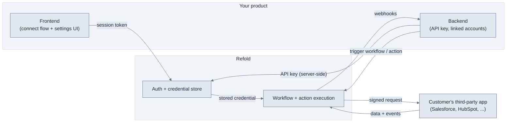

A Native integration connects three systems: your product, Refold, and the third-party apps your customers use. Your product owns the user experience and the data, Refold owns authentication and execution, and the third-party app owns the customer's data on the other side. Understanding which system does what is the fastest way to design an integration that is secure and easy to operate.

This page is the mental model. The objects it references (linked accounts, connectors, workflows, config fields) are defined once on the platform and linked from here, so you can go deeper on any one of them without leaving the path.

## The three systems

| System | Owns | Responsibility |
| --- | --- | --- |
| **Your product** | Your customers, your UI, your data | Embeds the connect flow, creates linked accounts, triggers data operations |
| **Refold** | Auth, credentials, execution | Runs the connection flow, stores and refreshes tokens, signs and executes every request, isolates tenants |
| **Third-party app** | The customer's account and data | Authorizes access and serves the read and write requests Refold makes on the customer's behalf |

The key consequence: your product never handles a customer's third-party credentials. The customer authorizes the app, Refold stores the credential against that customer's [linked account](/v3/platform/concepts/linked-account), and from then on your product references the linked account instead of any token.

## Architecture at a glance

## What runs where

Splitting the work across the three systems keeps your API key server-side and your customers' credentials with Refold.

- **Your backend** holds your API key, creates one [linked account](/v3/platform/concepts/linked-account) per customer, mints short-lived [session tokens](/v3/native/frontend/overview#before-you-start) for the frontend, triggers workflows and actions, and receives [webhooks](/v3/native/configure/developer/webhooks).
- **Your frontend** runs the [connect flow](/v3/native/frontend/overview) and renders [config fields](/v3/native/configure/integration/config-fields), authenticated by a session token, not your API key.
- **Refold** runs the connection and [auth flows](/v3/platform/authentication/overview), stores and refreshes credentials, and executes every [workflow](/v3/platform/concepts/workflows/overview) and action using the stored credential for the right linked account.
- **The third-party app** authorizes the connection and serves the requests Refold makes on the customer's behalf.

<Warning>
Your API key carries full account access, so it stays on your backend. The frontend authenticates with a session token instead. Never expose your API key in the browser.
</Warning>

## How the objects fit together

The four objects below combine to turn one connector into a working, per-customer integration. Each is defined once on the platform; this is how they relate in a Native build.

- **[Linked account](/v3/platform/concepts/linked-account)** is the unit of tenancy. Every connection, credential, config value, and data call is scoped to a linked account, which keeps one customer's data isolated from another's.
- **[Connector](/v3/platform/concepts/connector/supported-apps-actions)** is the third-party app and the set of actions Refold can run against it. You enable the connectors your customers can connect.
- **[Config fields](/v3/native/configure/integration/config-fields)** are the per-customer settings (which pipeline, which channel, which mapping) that let a single connector adapt to each customer's account. Customers fill them in when they connect or enable a workflow, and the values save against their linked account.
- **[Workflow](/v3/platform/concepts/workflows/overview)** is the automation that moves data. It reads config field values and connected-app data at run time, so the same workflow behaves correctly for every customer.

<Note>
Workflows are built and configured on the platform, not in Native. Native is where you embed the connect flow and [expose workflows](/v3/native/frontend/expose-workflow) to your customers. See [Workflows](/v3/native/configure/integration/workflow) for the Native-side view.
</Note>

## The end-to-end loop

Putting it together, every customer follows the same loop:

<Steps>
  <Step title="You create a linked account">
    When a customer signs up or first opens your integrations area, your backend creates a [linked account](/v3/platform/concepts/linked-account) with a stable ID.
  </Step>
  <Step title="The customer connects an app">
    Your embedded [frontend flow](/v3/native/frontend/overview) sends the customer through the app's auth flow. Refold stores the credential against their linked account.
  </Step>
  <Step title="The customer configures the integration">
    They fill in [config fields](/v3/native/configure/integration/config-fields) and enable the [workflows](/v3/native/frontend/expose-workflow) you offer. The values save against their linked account.
  </Step>
  <Step title="Your product moves data">
    Your backend triggers actions and workflows. Refold executes them with the customer's stored credential and returns results, then keeps you informed through [webhooks](/v3/native/configure/developer/webhooks).
  </Step>
</Steps>

## Next steps

<CardGroup cols={2}>
  <Card title="Quickstart" icon="rocket" href="/v3/native/get-started/quickstart">
    Run the full loop end to end in about 15 minutes.
  </Card>
  <Card title="Frontend" icon="window" href="/v3/native/frontend/overview">
    Embed the connect experience in your product.
  </Card>
  <Card title="Config fields" icon="sliders" href="/v3/native/configure/integration/config-fields">
    Adapt one connector to every customer's account.
  </Card>
  <Card title="Linked accounts" icon="user" href="/v3/platform/concepts/linked-account">
    The unit of tenancy behind every connection.
  </Card>
</CardGroup>
