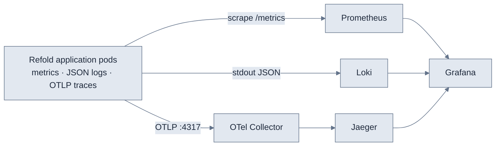

Every Refold service emits three telemetry signals: metrics, logs, and traces. Use this page to turn on OpenTelemetry tracing and route all three signals to your own observability backends, so a metric spike, the logs behind it, and the trace of a slow request are one or two clicks apart.

This applies to [self-hosted](/v3/platform/deployment/overview) deployments, where you operate the cluster and the observability stack. Refold Cloud and Refold Managed are instrumented and monitored for you.

## How observability works

Refold services run as stateless pods that emit telemetry in standard formats. Each signal travels its own pipeline to a standard store, and all three converge in a single dashboard layer such as Grafana.

| Signal | Emitted by each service as | Pipeline | Stored in | Viewed in |
|---|---|---|---|---|
| **Metrics** | `/metrics` on port `80`, with `prometheus.io` scrape annotations | Prometheus scrape (pull) | Prometheus | Grafana |
| **Logs** | Structured JSON to `stdout` | A node-level log agent ships to Loki | Loki | Grafana (LogQL) |
| **Traces** | OpenTelemetry SDK over OTLP gRPC on port `4317` | OTel Collector receives and exports | Jaeger | Jaeger UI / Grafana |



<Note>
  Metrics are **pulled** (Prometheus scrapes each pod's `/metrics`). Logs and traces are **pushed** by the pod (`stdout` for logs, OTLP for traces).
</Note>

Workloads stay namespace-portable. Metric scraping is annotation-based, so it works in any namespace, and the collector is reached by service DNS rather than a fixed location. You can run Refold in any namespace without re-pinning your observability targets.

## Enable tracing

Tracing is controlled per service by the `OTEL_ENABLED` environment variable. When it's on, each service exports spans over OTLP gRPC to the collector.

<Steps>
  <Step title="Set OTEL_ENABLED on the services">
    Set `OTEL_ENABLED=true` on the Refold services you want to trace. Each instrumented service then exports spans over OTLP gRPC.
  </Step>
  <Step title="Point the OTLP exporter at your collector">
    Send traces to your OTel Collector's OTLP gRPC endpoint on port `4317`. If you run the collector bundled with the deployment, the in-cluster address is:

    ```text OTLP endpoint
    otel-collector-opentelemetry-collector.observability.svc.cluster.local:4317
    ```

    To use your own collector, set the endpoint to its address instead.
  </Step>
  <Step title="Export from the collector to a backend">
    The OTel Collector batches spans and exports them to Jaeger, which persists them to its storage backend. Point the collector at your own Jaeger or any OTLP-compatible tracing backend.
  </Step>
  <Step title="View traces">
    Open the **Jaeger UI** or the Grafana trace view and search by service or operation to see end-to-end request flows across services.
  </Step>
</Steps>

<Tip>
  Logs carry trace IDs, so from a slow trace in Jaeger you can jump to the exact log lines in Loki and back.
</Tip>

## Collect metrics

Refold pods are annotated for Prometheus auto-discovery, so a Prometheus instance picks them up with no `ServiceMonitor` to define:

```yaml Pod annotations
prometheus.io/scrape: "true"
prometheus.io/path: "/metrics"
prometheus.io/port: "80"
```

Point your Prometheus at the cluster and it scrapes application metrics automatically. A `kube-prometheus-stack` install also scrapes `node-exporter`, `kube-state-metrics`, and cAdvisor, so you get pod CPU and memory, restarts, and node saturation alongside application metrics.

CPU and memory requests and limits are set per service. Grafana shows usage against requests, so you can right-size each service. Several services also support horizontal autoscaling on CPU utilization.

<Tip>
  Drive alerts from the metrics pillar: evaluate Prometheus alert rules (crashloops, out-of-memory, disk near-full, high latency or error rate, node pressure) and route them through Alertmanager to the pager of your choice.
</Tip>

## Collect logs

All services log structured JSON to `stdout`. A node-level agent running as a DaemonSet tails container logs and ships them to Loki, labeled by pod, namespace, and container.

Query logs in Grafana with LogQL. For example, to find errors for one service in one namespace:

```logql
{namespace="<your-namespace>", app="<service-name>"} |= "error"
```

## Tune the collector

The OTel Collector enforces receiver and queue limits (`memory_limiter` and `sending_queue`) so a surge of traces can't exhaust its memory.

<Note>
  If you see `RESOURCE_EXHAUSTED` in the collector logs, a trace surge is hitting those limits. Raise the `memory_limiter` and `sending_queue` settings to give the collector more headroom.
</Note>

## See also

- [Deployment overview](/v3/platform/deployment/overview): pick a deployment model and install Refold.
- [Architecture](/v3/platform/deployment/architecture/overview): how Refold's services fit together.
- [Troubleshooting](/v3/platform/deployment/troubleshooting): diagnose common deployment issues.
